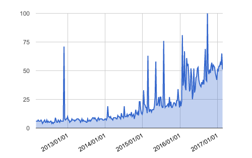
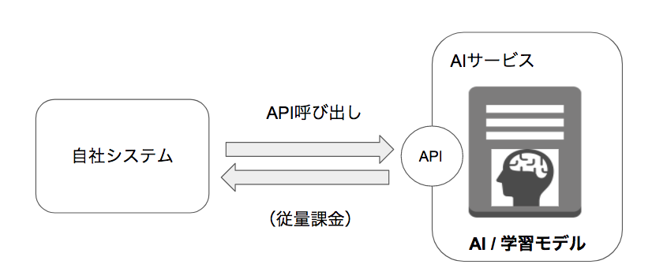
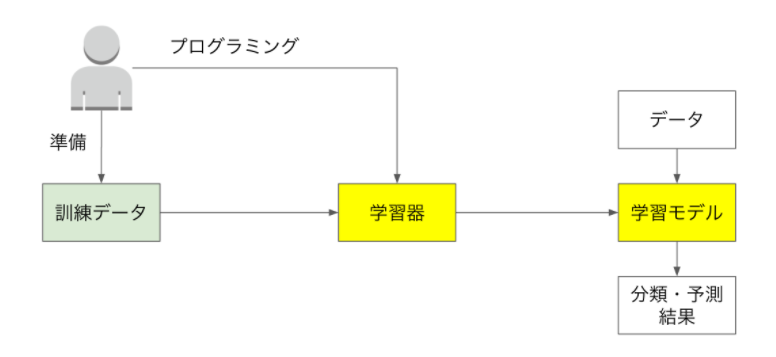
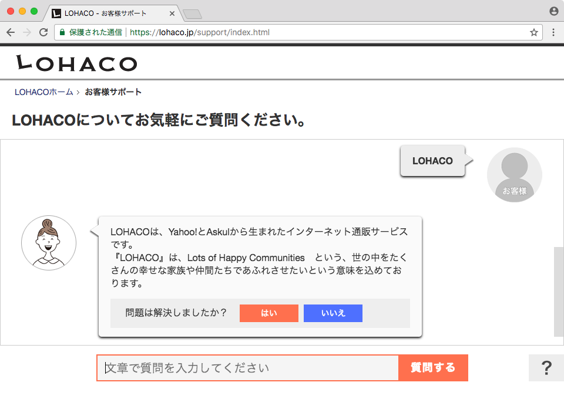
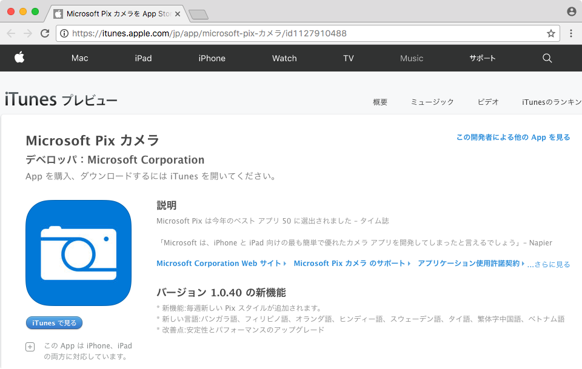
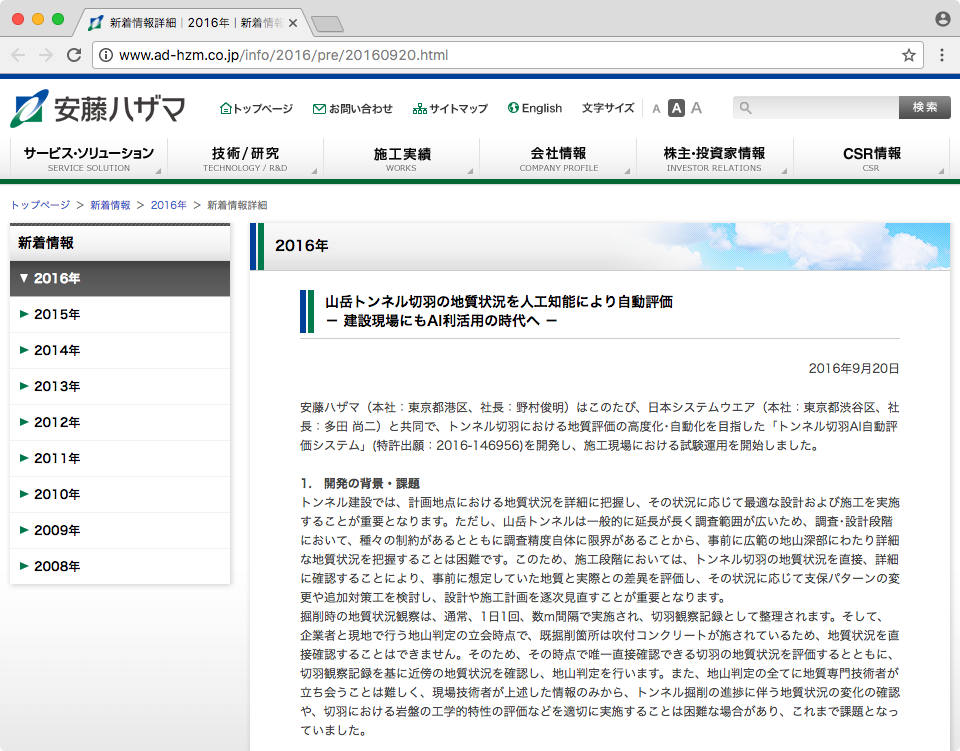

# 1 AI

これは「AI」というトピックでのGoogle Trendsの結果です。2014年から徐々に増加しはじめて、2016年から2017年に掛けて増加の勢いが増しているのが見て取れます。

現在のAIブームは第3次AIブームと言われています。過去2度のブームは大きな社会の流れにはならずに終焉しました。しかし、今回ブームはこの傾向はまだ暫く続くだけでなく、社会を変革するトレンドになると多くのシンクタンクやメディア、政府、アナリストが予想しています。

それでは、これまでのブームと現在のAIは一体何が違うのでしょうか？現在のAIでは一体何が出来るようになったのでしょうか？

この講座ではハンズオンを交えながら技術的側面から、AIの現状を理解し、実践できるようになることを目標としています。AIは今後も変化・進歩の激しい分野ではありますが、本講座の学習内容が、AIの理解の第一歩となればと思っています。

|時代|AIの特徴|
|:--|:--|
|第1次AIブーム 1950 〜1960年代|探索・推論アルゴリズムの時代 迷路やチェスのようなゲーム攻略（トイ・プロブレム）が中心|
|第2次AIブーム 1980年代|エキスパートシステムの時代 専門家の知識をAIに登録する|
|第3次AIブーム 2010年頃〜|ディープラーニングによるブレイクスルー（子どものAI） 画像認識や音声認識技術の大幅な精度の向上|

## 1.1 AIの定義

AI（=Artificial Intelligence=人工知能）は非常に広い概念で、様々な分類・区分けがあります。その一つが「汎用AI」と「特化型AI」です。

### 汎用AI

人間のように、あらゆる状況を判断することの出来るAIを言います。人間と同等の学習、推論、反応を示すことを目標としています。汎用AIの研究は進んでいますが、実用化にはまだまだ時間のかかる研究分野です。

> 例）ドラえもん（ドラえもん）／J.A.R.V.I.S.（アイアンマン）

### 特化型AI

特定の課題を解決する目的で、学習、推論が出来るAIを言いいます。対象とする課題においては人間以上の成果を示すこともあります。現在ビジネスの場で活用されているAIはこの特化型AIを指します。

> 例）AlphaGo（DeepMind）／Watson（IBM）

本講座で学習するAIは、この特化型AIに分類されます。

## 1.2 大人のAI、子どものAI

「コンピュータ（AI）はチェスに強くても、花を見て花と認識したり、ものをつかんだり、といった、子どもにできることができない。」

これはモラベックのパラドックスと呼ばれるもので、従来のAIの得意なこと、苦手なことをうまく言い表しています。実は、現在のAIは花を見て花と認識することや、ものをつかむ、という動作を実現できる段階にあります。それでは従来のAIと現在のAIの違いとは一体何なのでしょうか。

AIを分類するときに大人のAI、子どものAIといった分け方があります。大人のAIとは人間が作り込んだAIを指します。これは人が設計したルールをコンピュータにプログラミングしたAIのことです。

一方の子どものAIは、コンピュータが子どものように自分でルールを学習していくプログラムです。子どものAIでは、AIの開発者が複雑なルールを考え、設計する必要はありません。膨大なデータからコンピュータに学習させて、コンピュータ自身に法則性を見つけさせるのです。

子どものAIを実現する手法として注目を集めているのがディープラーニングです。AIの専門家でなくても、誰もがAIを開発できる時代が来ているのです。

## 1.3 AIとプログラム

AIも結局はプログラムであることに変わりはありませんが、AIと呼ばれるプログラムと一般的なプログラムには違いがあります。

たとえば次の画像ファイルについて考えてみましょう。

上記のような画像ファイルを処理するプログラムは次のようなものがあるでしょう。

+ 画像サイズ（400, 400）を（200, 200）に変更する
+ 画像をグレースケールに変更する
+ 200,200の位置のピクセルのカラーを取得する

これらの処理は従来のプログラムで実装可能です。画像処理の経験のあるプログラマーであれば実装方法が想像できるでしょう。

それでは以下の処理はどうでしょうか。

+ この花はアサガオかどうか判定する
+ この花は美しいかどうか判定する
+ この花が枯れるのはいつか予測する

プログラマーであっても「アサガオかどうか判定する方法」が具体的ではないため、実装方法に戸惑うでしょう。同様に「美しい花」の定義が曖昧ですし、「いつ枯れるのか」のいう予測も、花の開き具合から判断するのか、そもそも花の開き具合を判定する方法はどのように測るのか、と考えていくと簡単ではないと気づくでしょう。

現在のAIが得意な分野はここにあります。AIの中にはルールがあります。たとえば囲碁を打つAIであれば、次の一手を決定するのがルールです。このルールを人が設計するのか、コンピュータ自身が設計するのか、ここに大きな違いがあります。現在話題になる多くのAIは機械学習と呼ばれる手法を用いて、コンピュータがデータからルールを設計します。このルールのことをモデルと呼ぶこともあります。

## 1.4 AIの活用方法

少し視点を変えて、現在のビジネスシーンにおいてAIを活用する方法を整理してみましょう。大きく2つにわけることができるでしょう。

+ AIサービスの活用
+ 機械学習ライブラリによる開発

### AIサービスの活用

Googleのクラウドプラットフォーム（GCP）やIBMのコグニティブサービスWatsonでは、画像認識や音声認識、自然言語処理といった機能がサービスとして公開されています。これらのサービスは専用のアカウントを作成すれば、すぐに活用することができます。

### 機械学習ライブラリによる開発

Python言語を中心にTensorFlowなどの機械学習ライブラリが充実しています。これらのライブラリを活用することで自社のビジネスに特化したAIを開発することも可能です。

本講座では機械学習ライブラリの活用方法を紹介します。

## 1.5 AIの活用事例

最後にAIの活用事例をいくつか見てみましょう。

### チャットボットまなみさん LOHACO By ASKUL

インターネット通販サービスLOHACOではお客様サポートページにチャットボットまなみさんを導入しています。

https://lohaco.jp/support/index.html

IBMのWatsonをベースに開発されたチャットボットは、利用者からの問い合わせに対して適切なサポートメッセージを表示します。

> チャットボットのような言語処理は、AIの中でも自然言語処理と呼ばれる分野です。

### Microsoft Pix カメラ

Microsoft Pix カメラは 連写して撮影した写真の中から一番良い写真を判別してくれます。「一番良い写真」という曖昧な判定条件は従来のプログラムでは設計の難しい分野です。人間のような感覚を搭載したAIをうまく活用しているケースと言えるでしょう。

### トンネル切羽AI自動評価システム 安藤ハザマ

画像認識技術はビジネスシーンでも活用されています。安藤ハザマ社の開発したトンネル切羽AI自動評価システムはコーポレートページ上で以下のように解説されています。

> ｢トンネル切羽AI自動評価システム｣は、人工知能の画像認識技術を活用し、切羽写真から岩盤の工学的特性を自動評価するものです。

採掘現場の切羽写真とその地質の特性をディープラーニング（畳み込みニューラルネットワーク）によって学習し独自のAIシステムを開発しています。

