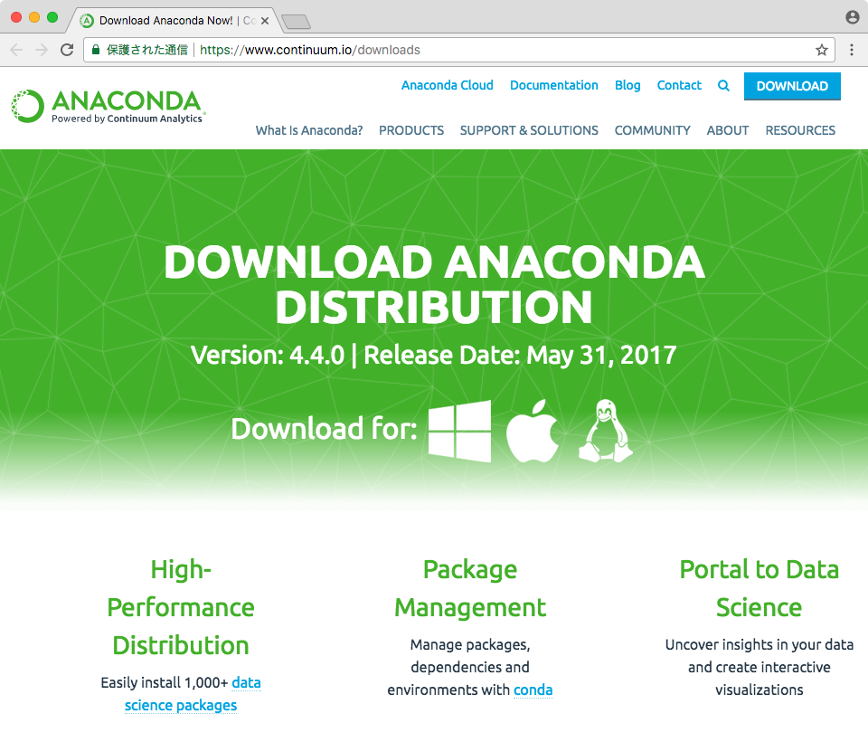
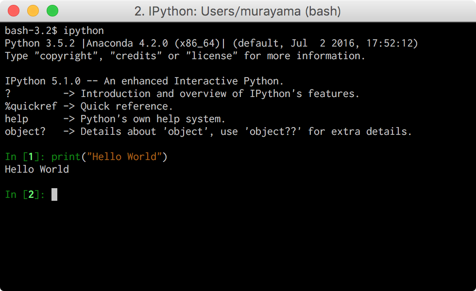
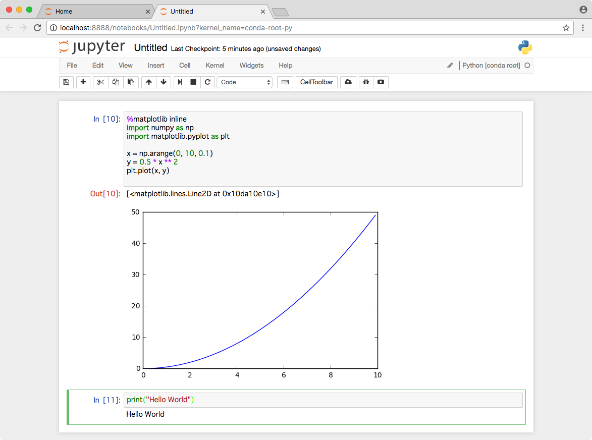

## 1.6 Python入門

本講座ではPython言語を活用して機械学習の理解を深めます。Pythonは多目的に活用できるシンプルで扱いやすい言語です。インデントによってif文やfor文などのスコープを表現するという特徴があります。また機械学習ライブラリが充実しているため近年注目を集めています。

### Anaconda

Pythonで機械学習を始めるにはCONTINUUM社の配布しているはAnacondaディストリビューションを活用すると良いでしょう。以下のURLからダウンロートすることができます。

https://www.continuum.io/downloads


AnacondaにはPython本体だけでなく、機械学習に必要なライブラリも梱包されているため、すぐに機械学習プログラミングを始めることができます。




> 本講座のプログラムは Python 3.5.2 :: Anaconda 4.2.0 (x86_64) で動作確認しています。

<div style="page-break-before:always"></div>


### ipython

Anacondaにはipythonというインタラクティブなpythonツールが含まれています。ターミナル（コマンドプロンプト）上で ipython コマンドを実行すると対話形式でpythonプログラムを実行できます。標準の python コマンドも対話形式でプログラムを実行できますが、ipython はコードハイライトやコード補完機能が強化されています。




<div style="page-break-before:always"></div>

### Jupyter Notebook

AnacondaにはJupyter Notebookというブラウザ上で動作するPython開発環境も付属しています。ターミナル（コマンドプロンプト）上で jupyter-notebook コマンドを実行するとローカルでサーバプログラムが起動し、ブラウザが起動します。



> デフォルトでは8888番ポートで起動します。

Jupyter Notebookでは、ノートブックという形式でファイルを作成できます。ノートブックにはPythonコードや実行結果だけでなく、Markdown形式で文章を挿入することもできるので、データ分析の評価レポートを作成しやすいようになっています。

> ノートブックファイルは拡張子.ipynbという形式保存されます。

Jupyter Notebookの実体はブラウザで利用するWebアプリケーションです。そのためサーバ上でJupyter Notebookを起動すれば、手元のパソコンのブラウザからサーバ上でPythonプログラムを実行することも可能です。複数の利用者がデータ解析を共有する場合にも便利でしょう。

<div style="page-break-before:always"></div>


## 1.7 速習 Python

それでは実際にPythonプログラムの概要を見てみましょう。

### Hello World

画面に"Hello World"を表示してみましょう。

```python
print("Hello World")
```

実行結果は次のように表示されるでしょう。

```
Hello World
```


### 変数とデータ型

Pythonの文字列、数値、実数、真偽値型、None型を確認してみましょう。

```python
name = "John"
age = 20
height = 170.1
license = True # False
money = None

print(type(name))
print(type(age))
print(type(height))
print(type(license))
print(type(money))
```

実行結果は次のように表示されるでしょう。

```
<class 'str'>
<class 'int'>
<class 'float'>
<class 'bool'>
<class 'NoneType'>
```

type関数を使えばデータ型を確認できます。

> Pythonプログラムの中でコメントは # で表現します。

<div style="page-break-before:always"></div>


### if文

if文は次のようになります。論理積を表現するときは and キーワードでつなぎます。また他言語のように {} は使わずにインデントでスコープを表現します。

```python
name = "John"
age = 20
license = True

if age >= 20 and license:
    print("OK {}".format(name))
else:
    print("NG")
```

実行結果は次のように表示されるでしょう。

```
OK John
```

> 論理和は or キーワードを使います。


### for文

for文を使って繰り返し構造を定義できます。指定回数繰り返すにはrange関数を使います。

```python
for i in range(3):
    print(i)

for i in range(1, 3):
    print(i)

for i in range(3, 1, -1):
    print(i)
```

実行結果は次のように表示されるでしょう。

```
0
1
2
1
2
3
2
```

<div style="page-break-before:always"></div>


### リスト

Pythonは [] キーワードでリスト（配列）を生成できます。

```python
fruits = ["apple", "banana", "cherry"]

print(fruits[1])

for fruit in fruits:
    print(fruit)

for i, fruit in enumerate(fruits):
    print(i, fruit)
```

実行結果は次のように表示されるでしょう。

```
banana
apple
banana
cherry
0 apple
1 banana
2 cherry
```

> enumerate関数を使えば、インデックスとリストの要素を取り出すことができます。


### ディクショナリ

Pythonは {} キーワードでディクショナリを生成できます。ディクショナリとはキーと値をマッピングしたものです。

```python
fruits = {"apple":100, "banana":200, "cherry":300}

print(fruits["apple"])

for key in fruits:
    print(key, fruits[key])
```

実行結果は次のように表示されるでしょう。

```
100
apple 100
banana 200
cherry 300
```

<div style="page-break-before:always"></div>


### 関数

Pythonではdefキーワードを使って関数を定義します。

```python
def sum(start, end):
    result = 0
    for i in range(start, end + 1):
        result = result + i
    return result

print(sum(1, 1))
print(sum(1, 5))
print(sum(1, 10))
```

実行結果は次のように表示されるでしょう。

```
1
15
55
```

<div style="page-break-before:always"></div>

### クラス

Pythonはオブジェクト指向言語です。クラスを定義するには次のように実装します。

```python
class Car:
    def __init__(self, name, gas):
        self.name = name
        self.gas = gas

    def move(self):
        if self.gas > 0:
            self.gas = self.gas - 1
            print("{}: move".format(self.name))
        else:
            print("{}: stop".format(self.name))


car1 = Car('kbox', 3)
car2 = Car('Kwagon', 5)

for i in range(5):
    car1.move()
    car2.move()
```

実行結果は次のように表示されるでしょう。

```
kbox: move
Kwagon: move
kbox: move
Kwagon: move
kbox: move
Kwagon: move
kbox: stop
Kwagon: move
kbox: stop
Kwagon: move
```

クラスの中でインスタンス自身を参照するにはselfキーワードを使います。またクラスに定義したメソッドの第1引数にはselfを指定する必要があります。また、クラスにコンストラクタを定義する場合は \_\_init\_\_メソッドを実装します。

> クラスからインスタンスを生成するときにnewキーワードは不要です。
