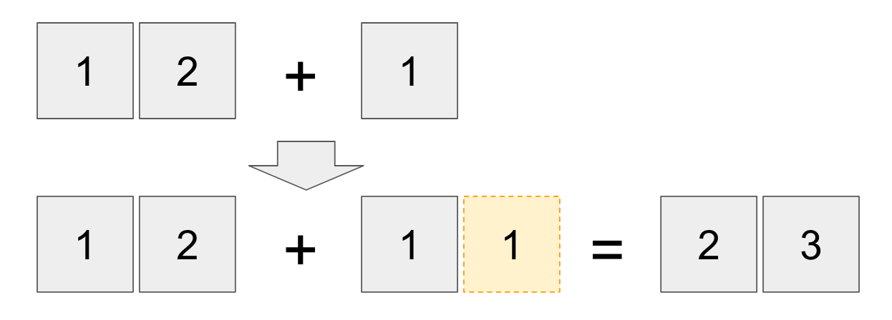
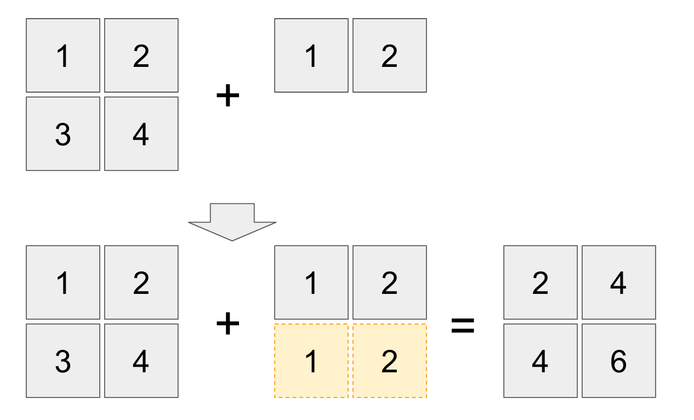

## 1.8 NumPy

NumPyはPythonの数値計算ライブラリです。本講座では主にテストデータの作成や、ニューラルネットワーク上の演算（行列演算）に利用します。

NumPyを使う場合は以下のようにimportします。

```python
import numpy as np
```

<div style="page-break-before:always"></div>


### NumPy配列の作成

NumPy配列を生成するにはいくつかの方法があります。

```python
import numpy as np

a = np.arange(3)
print(a)

b = np.array([10, 20, 30])
print(b)

c = np.random.rand(3)
print(c)
```

実行結果は次のように表示されるでしょう。

```
[0 1 2]
[10 20 30]
[ 0.20971528  0.86719696  0.70371265]
```


配列の要素の範囲を指定して生成する場合は np.arange メソッドを使います。

```python
a = np.arange(3)
```

上記の場合 [0 1 2] というNumPy配列が生成されます。

またnp.arrayメソッドを使えば通常の配列をNumPy配列に変換することができます。

```python
b = np.array([10, 20, 30])
```

上記の場合 [10 20 30] というNumPy配列が生成されます。

np.random.randメソッドを使えば、乱数で構成される配列を生成できます。

```python
c = np.random.rand(3)
```

乱数は [ 0.56886361  0.68599281  0.7017446 ] のように表示されるでしょう。

<div style="page-break-before:always"></div>


### 配列の操作

次は配列の操作について見てみましょう。

```python
import numpy as np

a = np.array([1, 2, 3, 4, 5, 6, 7, 8, 9])
print(a)
print(a.shape)

print(a[1])
print(a[1:5])
print(a[5:])
```

実行結果は次のように表示されるでしょう。

```
[1 2 3 4 5 6 7 8 9]
(9,)
2
[2 3 4 5]
[6 7 8 9]
```

NumPy配列は shape プロパティにアクセスすることで、配列の次元ごとの要素数をタプルで取得できます。上記の場合は (9,) と表示されます。

> タプルはリストと同じように扱うことができますが、内部の要素を変更することはできません。


PyhtonのリストやNumPy配列は要素へのアクセスを柔軟に指定できます。

```python
print(a[1])   # => 2
print(a[1:5]) # => [2 3 4 5]
print(a[5:])  # => [6 7 8 9]
```

> NumPy配列でなく通常のリストでも上記のようにアクセスできます。

<div style="page-break-before:always"></div>


NumPy配列は次元数を変更することもできます。次のプログラムを見てみましょう。

```python
import numpy as np

a = np.array([1, 2, 3, 4, 5, 6, 7, 8, 9])
b = a.reshape(3, 3)
print(b)
print(b.shape)

print(b[1])
print(b[1,1])

print(b[0:2])
print(b[0:2,1])

print(b[:,2])
```

実行結果は次のように表示されるでしょう。

```
[[1 2 3]
 [4 5 6]
 [7 8 9]]
(3, 3)
[4 5 6]
5
[[1 2 3]
 [4 5 6]]
[2 5]
[3 6 9]
```

NumPy配列は reshape メソッドによって配列の次元数を変更できます。

```python
b = a.reshape(3, 3)
```

また多次元配列は次のようにカンマ区切りで要素にアクセスできます。

```python
print(b[1,1])
```

少し特殊な書き方ですが、次のように2次元目の要素番号だけを指定することもできます。

```python
print(b[:,2])
```

<div style="page-break-before:always"></div>


### NumPy配列の演算

NumPy配列の演算を見てみましょう。

```python
import numpy as np

a = np.array([1, 2, 3])
b = np.array([4, 5, 6])

c = a + b
print(c)

d = a * b
print(d)

e = a.dot(b)
print(e)
```

実行結果は次のように表示されるでしょう。

```
[5 7 9]
[ 4 10 18]
32
```

NumPy配列の各要素ごとに加算や、積算することができます。

```python
c = a + b
print(c) #=> [5 7 9]

d = a * b
print(d) #=> [ 4 10 18]
```

また2つの配列（ベクトル）の内積を求めるにはdotメソッドを使います。

```python
e = a.dot(b)
print(e) #=> 32
```

> dot積は (1 \* 4) + (2 \* 5) + (3 \* 6) = 32 となります。

<div style="page-break-before:always"></div>


### ブロードキャスト

NumPy配列は次元数の異なるオペランドを演算することができます。このような仕組みをブロードキャストと呼びます。

```python
import numpy as np

a = np.array([1, 2])
b = a + 1
print(b)

c = np.array([[1, 2], [3, 4]])
d = c + a
print(d)
```

実行結果は次のように表示されるでしょう。

```
[2 3]
[[2 4]
 [4 6]]
```




