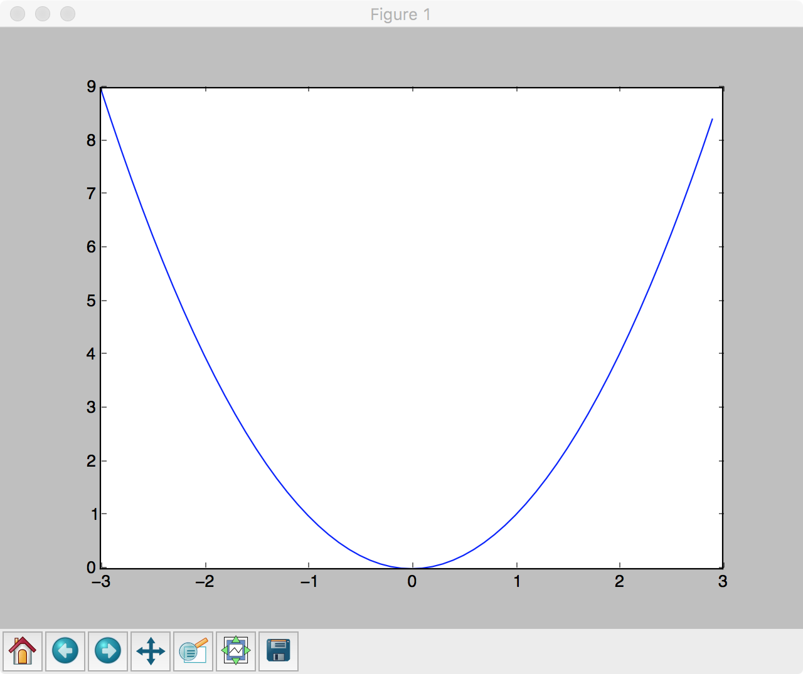
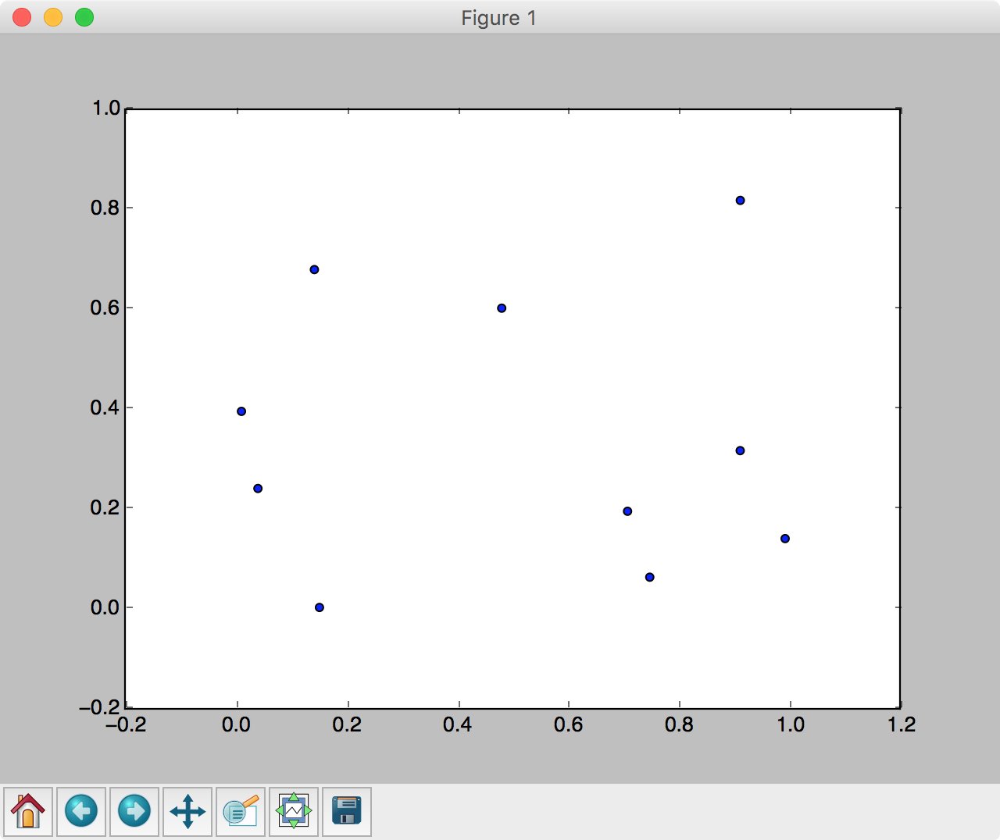
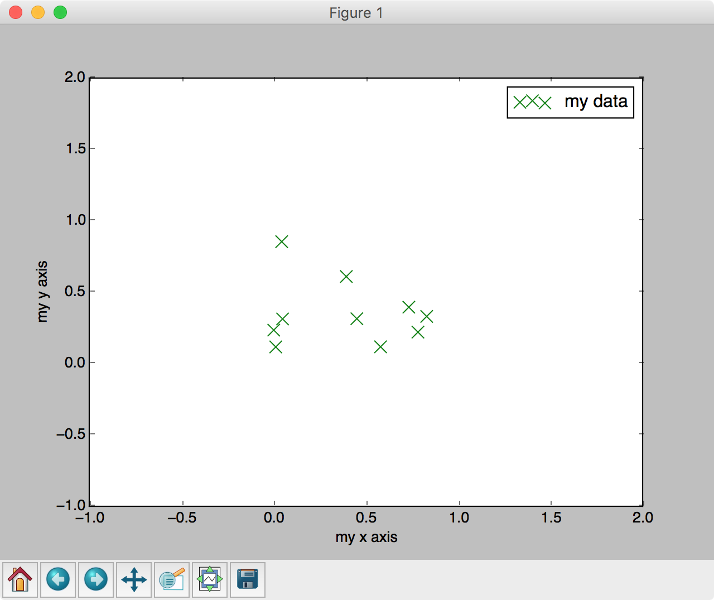

## 1.9 Matplotlib

MatplotlibはPythonのグラフ描画ライブラリです。本講座では主に折線グラフや散布図を表示するために利用します。

Matplotlibを使う場合は以下のようにimportします。

```python
import matplotlib.pyplot as plt
```

またJupyter Notebookで実行する場合は以下のように記述するとグラフをinline表示できます。

```python
%matplotlib inline
```

> ノーブックの先頭にimportの前に記述しておくと良いでしょう。

<div style="page-break-before:always"></div>

### グラフの描画

#### 折れ線グラフの表示

Matplotlibで折れ線グラフを表示するには次のように実装します。

```python
import matplotlib.pyplot as plt
import numpy as np

x = np.arange(-3, 3, 0.1)
y = x**2

plt.plot(x, y)
plt.show()
```

実行結果は次のように表示されるでしょう。




ここではテストデータとしてNumpy配列 x、y を作成しています。次にplt.plotメソッドを呼び出して折れ線グラフを作成しています。最後にplt.showメソッドを呼び出すとウィンドウが表示されます。

<div style="page-break-before:always"></div>


#### 散布図の表示

Matplotlibで散布図を表示するには次のように実装します。

```python
import numpy as np
import matplotlib.pyplot as plt

x = np.random.rand(10)
y = np.random.rand(10)

plt.scatter(x, y)
plt.show()
```

実行結果は次のように表示されるでしょう。




先ほどと同じようにここではテストデータとして、ランダムな要素を持つNumpy配列 x、 y を作成しています。次にplt.scatterメソッドを呼び出して散布図を作成しています。最後にplt.showメソッドを呼び出すとウィンドウが表示されます。

<div style="page-break-before:always"></div>


#### （参考）グラフのカスタマイズ

グラフには凡例（legend）を付けたり、x軸（y軸）に説明に説明を付けたり、様々なカスタマイズができるようになっています。先ほどの散布図の表示をカスタマイズしてみましょう。

```python
import matplotlib.pyplot as plt
import numpy as np

x = np.random.rand(10)
y = np.random.rand(10)

plt.xlim(-1, 2)
plt.ylim(-1, 2)

plt.xlabel("my x axis")
plt.ylabel("my y axis")

plt.scatter(x, y, s=100, label="my data", marker='x', color="green")
plt.legend()
plt.show()
```

実行結果は次のように表示されるでしょう。



プログラムの詳細を見てみましょう。

x軸、y軸の表示範囲を指定するには plt.xlim、ylim メソッドを使います。

```python
plt.xlim(-1, 2)
plt.ylim(-1, 2)
```

上記の場合、x軸、y軸ともに表示範囲が -1 から 2 までになります。


x軸、y軸の説明を追加するには plt.xlabel、ylabelメソッドを追加します。


```python
plt.xlabel("my x axis")
plt.ylabel("my y axis")
```


散布図の表示をカスタマイズするには、scatterメソッドの引数を指定します。

```python
plt.scatter(x, y, s=100, label="my data", marker='x', color="green")
```

ここではサイズに100を指定し、凡例用のラベルに"my data"、マーカーの形状に"x"、カラーに"green"をそれぞれ指定しています。また、データの凡例ラベル（"my data"）をグラフ上に表示するにはplt.legendメソッドを呼び出す必要があります。

```python
plt.legend()
```
