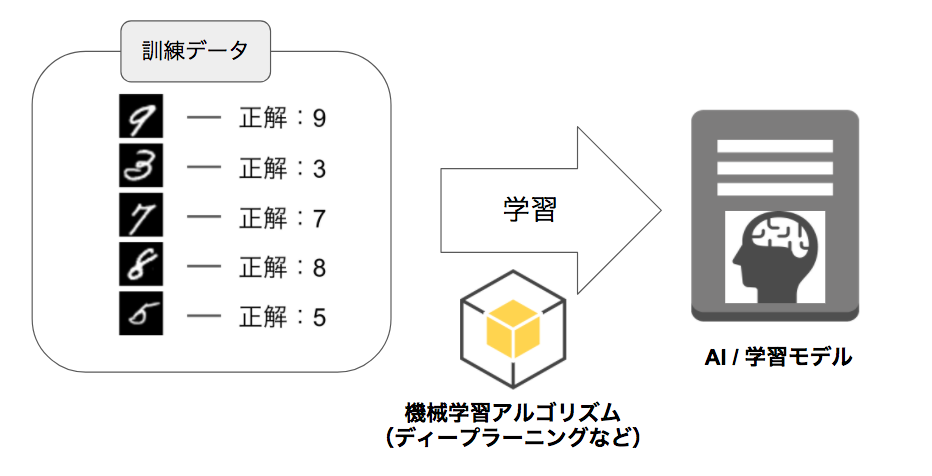
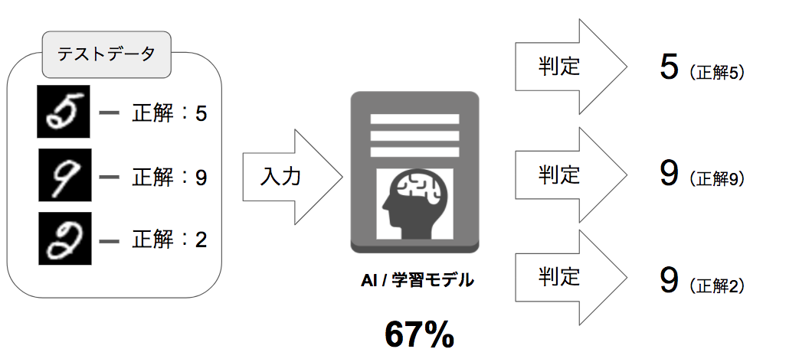
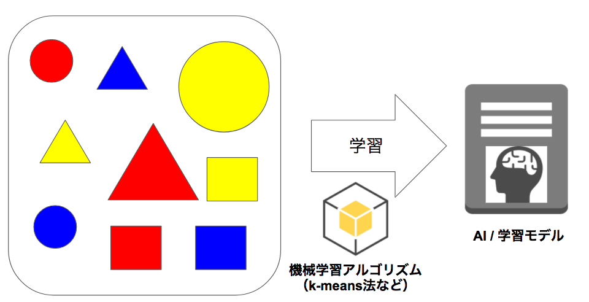
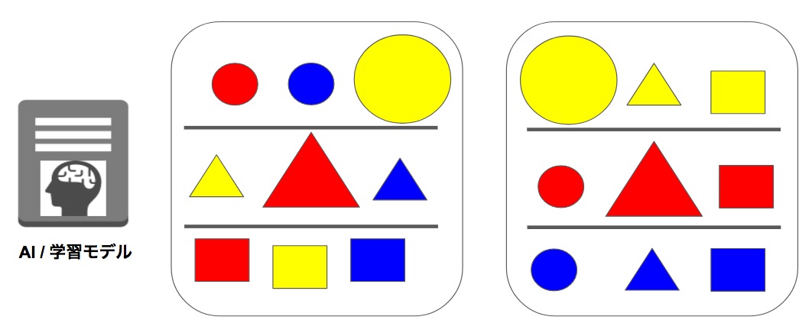

# 2 機械学習

現在のAIブームを牽引するキーワードが機械学習です。機械学習は膨大なデータから規則性（モデル）を見つけ出し、コンピューターに学習させる技術です。そのため数学の統計・分析の手法が利用されます。

機械学習には様々な手法があります。

+ 線形回帰
+ ロジスティック回帰
+ 決定木
+ SVM
+ k-NN法（K近傍法）
+ k-Means法（K平均法）
+ ニューラルネットワーク

以前はこれらの機械学習を行うにはアルゴリズムを理解し、自分でプログラミングする必要がありました。そのため、高度な数学の知識、統計の知識とプログラミングのスキルが必要で、ごく限られた研究者以外には活用することができませんでした。

近年、プログラミング言語Pythonを中心に機械学習ライブラリの充実しています。機械学習の手法、特徴や使い方を理解して、プログラミングができれば簡単に機械学習に取り組むことができるようになっています。このような外部環境の変化も近年のAI・機械学習の爆発的な発展の一つの要因であると言えます。

> ハードウェアの性能向上やインターネット、クラウドの登場もAI・機械学習ブームを支える一つの要因です。

## 2.1 教師あり学習と教師なし学習

さきほど紹介した機械学習の手法は学習に用いるデータによって、大きく2種類に分類することができます。教師あり学習と教師なし学習です。

### 教師あり学習

教師あり学習では、学習する際に対象のデータとそのラベル（答え）を用います。機械学習の多くの場合でこの教師あり学習が使われます。

#### 訓練データとテストデータ

教師あり学習では、訓練データとテストデータという2つのデータを用意します。訓練データを使ってモデルを訓練した後、テストデータを使って未知のデータに対する汎化性能を検証します。

### 教師なし学習

教師なし学習では学習対象となるデータのみを学習させます。データに正解ラベルはありません。

教師なし学習は主にクラスタ分類に用いられます。

教師なし学習の手法にはK-means（K平均法）などがあります。

### 参考（強化学習）

その他にも強化学習という手法も注目を集めています。強化学習は広義には教師なし学習に分類されます。強化学習は、ある特定の環境内において、ランダムに動作しながら、得られる報酬がもっとも高くように訓練していく学習方法です。Google Deep Mind社は「ブロック崩しゲーム」を強化学習を用いて解決する様子をYoutube動画（Google DeepMind's Deep Q-learning playing Atari Breakout）で公開しています。

## 2.2 機械学習とディープラーニング

現在のAIブームの火付け役となったのがディープラーニングです。DeepLearningはニューラルネットワークの中の一分野ですが、ここ数年で圧倒的な成長を遂げています。機械学習とディープラーニングは混同されやすいですが、ディープラーニングは機械学習の手法の一つです。具体的にはニューラルネットワークという技法を拡張した学習アルゴリズムです。またディープラーニングの中でもCNN（Convolutional Neural Network）やRNN（Recurrent Neural Network）などいくつかの手法に分かれます。これらについては後の章で取り上げます。

+ 機械学習
  + ニューラルネットワーク
      + ディープラーニング
        + FFNN
        + CNN
        + RNN
