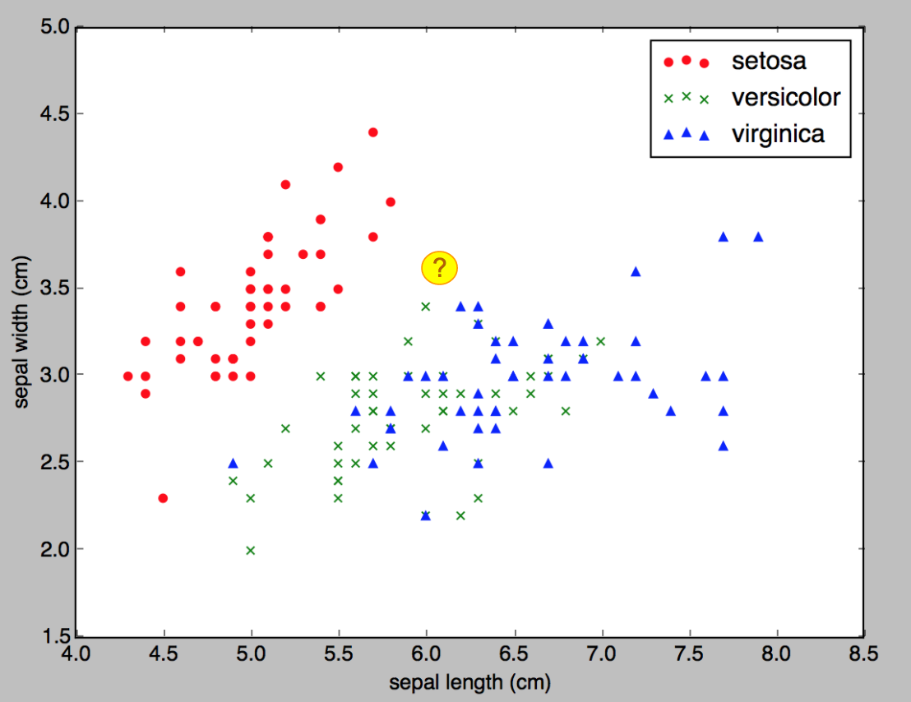
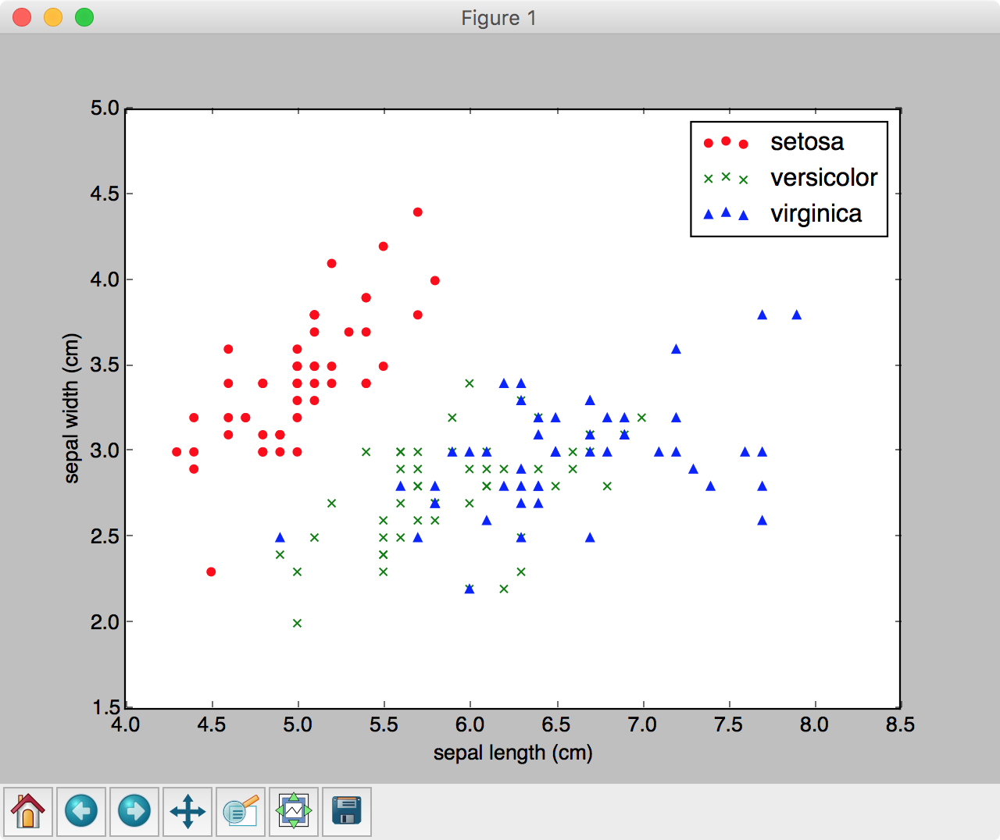
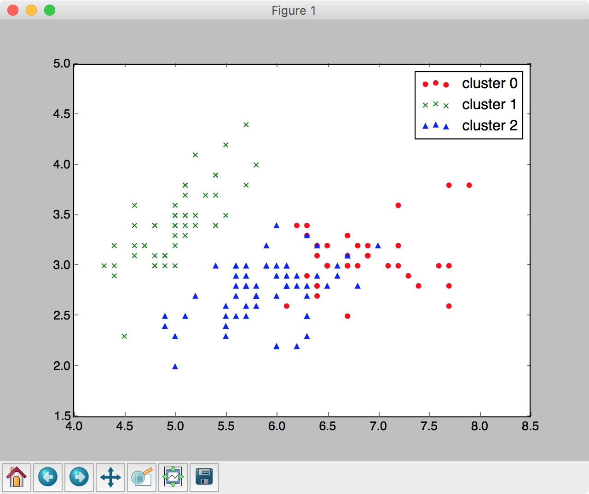

## 2.3 scikit-learnによる機械学習

scikit-learnはデータ解析やデータマイニングをシンプルに、かつ効果的に行えるライブラリです。線形回帰、決定木、SVMなど多くの機械学習手法が実装されているため、手軽に機械学習にチャレンジすることができます。

http://scikit-learn.org/stable/

scikit-learnのサイトには以下のキーワードがあります。

+ Classification（分類）
+ Regression（回帰）
+ Clustering（クラスタリング）
+ Dimensionality reduction（次元削減）
+ Model selection（モデル選定）
+ Preprocessing（前処理）

分類や回帰は教師あり学習、クラスタリングや次元削減は教師なし学習の範囲になります。加えて、機械学習を行う上でのデータの前処理や、作成したモデルの検証など、機械学習に必要な様々な機能がライブラリとして用意されています。

<div style="page-break-before:always"></div>


## 2.4 scikit-learn入門（教師あり学習）

ここではPythonの機械学習ライブラリscikit-learnを使って、教師あり学習を中心に学習してみましょう。

### 線形回帰

まずはシンプルなプログラムを作成してみましょう。次のプログラムは線形回帰を行うものです。

> ここでは y = a * x + b という数式モデルの線形回帰問題を取り上げます。ここで a は係数、b は切片と呼びます。また y は 目的変数、 x は説明変数などと呼びます。与えられたデータから 係数 a と切片 b を見つけるのがプログラムの目的になります。

```python
import numpy as np
from sklearn.linear_model import LinearRegression

x = np.array([0, 1, 2, 3, 4, 5]).reshape(-1, 1)
y = np.array([5, 7, 9, 11, 13, 15]).reshape(-1, 1)

reg = LinearRegression()
reg.fit(x, y)

print(reg.predict([[6], [7], [8]]))

print(reg.coef_)
print(reg.intercept_)
```

実行結果は次のように表示されるでしょう。

```
[[ 17.]
 [ 19.]
 [ 21.]]
[[ 2.]]
[ 5.]
```

実行結果から x が 6, 7, 8 のとき、yの値はそれぞれ 17, 19, 21と予測しているのがわかります。また算出したモデルの係数、切片をそれぞれ 係数：2.0、切片 5.0と算出しています。

<div style="page-break-before:always"></div>


プログラムの詳細を見てみましょう。scikit-learnには様々な機械学習アルゴリズムが実装されているので、importによって利用することができます。

```python
from sklearn.linear_model import LinearRegression
```

ここでは線形回帰（LinearRegression）クラスをimportとしています。

次にサンプルデータを準備しています。

```python
x = np.array([0, 1, 2, 3, 4, 5]).reshape(-1, 1)
y = np.array([5, 7, 9, 11, 13, 15]).reshape(-1, 1)
```

ここではreshapeメソッドを使って、変数 x と y を2次元配列に変換しています。

> reshapeメソッドによって x は 二次元配列 [[0], [1], [2], [3], [4], [5]] となります。y も同様に[[5], [7], [9], [11], [13], [15]] となります。

次にLinearRegressionオブジェクトを生成し、reg.fitメソッドによってデータを学習させています。

```python
reg = LinearRegression()
reg.fit(x, y)
```

学習はすぐに終わるので、未知のデータを投入して、予測（回帰）を確認してみましょう。

```python
print(reg.predict([[6], [7], [8]])) #=>[[ 17.] [ 19.] [ 21.]]
```

また求めた係数や切片は以下のように確認できます。

```python
print(reg.coef_)
print(reg.intercept_)
```

変数regのcoef_は coefficient（係数）、intercept_ はintercept（切片）を意味します。scikit-learnでは学習済みのモデルから係数や切片の値を取得することができます。

> このサンプルではノイズのないデータを扱いましたが、実際には訓練データにノイズが含まれるのが普通です。

<div style="page-break-before:always"></div>

### k-NN法による分類

続いてデータの分類を行う機械学習プログラムを見てみましょう。

> 教師あり学習で扱う問題は、回帰と分類に分かれます。

ここではk-NN法（k-nearest neighbor algorithm）を取り上げます。日本語ではk近傍法とも呼ばれます。k近傍法は最寄りのデータを参考に分類を行うシンプルなアルゴリズムです。



例えば、x0、x1 の2点で構成されるデータの場合を考えてみましょう。これは説明変数が2つというケースですが、このようなケースは2次元のグラフ上に表現できます。k-NN法では、予め訓練データをこのグラフ上に表現しておき、未知のデータを投入した際に、最も近くにある点（データ）を参考に分類を行います。


> 実際には最寄りの1点だけで決定するのではなく、最寄りの3点、5点とパラメータを調整することができます。

<div style="page-break-before:always"></div>

### iris（アヤメ）データの分類 - 1 CSVファイルの分類

ここではテストデータとしてiris（アヤメ）データの分類にチャレンジします。具体的には次のようなCSVデータを訓練データに使います。

```csv
...
1,4.8,1.4
1,5.0,1.7
1,4.5,1.5
1,3.5,1.0
2,6.0,2.5
2,5.1,1.9
2,5.9,2.1
...
```

> ここでは60件の訓練データファイル（train01.csv）とテストデータファイル（test01.csv）を用意しています。


データは3列で構成しています。先頭列は品種を示します。1は'versicolor', 2は'virginica'という品種です。2列目、3列目はpetal（花びら）の縦、横幅です。

> 1,4.8,1.4 の場合、品種は 1:'versicolor' 花びらの縦幅 4.8cm、 横幅: 1.4cmという具合です。

<div style="page-break-before:always"></div>


それでは実際にirisデータの分類にチャレンジしてみましょう。

```python
import numpy as np
from sklearn.neighbors import KNeighborsClassifier

train = np.loadtxt("train01.csv",delimiter=",")
test = np.loadtxt("test01.csv",delimiter=",")

x_train = train[:,1:]
y_train = train[:,0]

x_test = test[:,1:]
y_test = test[:,0]

clf = KNeighborsClassifier()
clf.fit(x_train, y_train)

print(clf.predict(x_test))
print(y_test)
print(clf.score(x_test, y_test))
```

実行結果は次のようになるでしょう。

```
ris_csv.py
[ 1.  1.  1.  1.  1.  1.  1.  1.  1.  1.  1.  1.  1.  1.  1.  1.  1.  1.
  1.  1.  2.  2.  2.  1.  2.  2.  2.  2.  2.  2.  2.  2.  2.  2.  2.  2.
  2.  2.  2.  2.]
[ 1.  1.  1.  1.  1.  1.  1.  1.  1.  1.  1.  1.  1.  1.  1.  1.  1.  1.
  1.  1.  2.  2.  2.  2.  2.  2.  2.  2.  2.  2.  2.  2.  2.  2.  2.  2.
  2.  2.  2.  2.]
0.975
```

予測値と期待値はほぼ一致し、結果は97.5%という高い正答率となっています。

<div style="page-break-before:always"></div>

それではプログラムの詳細を見てみましょう。

scikit-learnでk-NN法による分類を行うには KNeighborsClassifier クラスをimportします。

```python
from sklearn.neighbors import KNeighborsClassifier
```

次にNumPyのloadtxtメソッドを使ってCSVファイルをロードし、訓練データとテストデータに分類しています。
```python
train = np.loadtxt("train01.csv",delimiter=",")
test = np.loadtxt("test01.csv",delimiter=",")

x_train = train[:,1:]
y_train = train[:,0]

x_test = test[:,1:]
y_test = test[:,0]
```

CSVファイルをロードした後、先頭列（解答）とそれ以外の列を分離しています。

> 機械学習では訓練データを使って学習し、テストデータで正答率を検証します。これによってモデルの汎化性能を評価します。


次に KNeighborsClassifier オブジェクトを生成しています。このようなデータの分類を行うオブジェクトは分類器などと呼ばれます。

```python
clf = KNeighborsClassifier()
clf.fit(x_train, y_train)
```

分類器を生成した後、clf.fitメソッドを呼び出して訓練データによる学習をスタートします。

学習を終えたら、テストデータで結果を検証してみましょう。ここでは予測値と期待値（y_test）を並べて出力しています。それからclf.scoreメソッドによって正答率も出力していています。

```python
print(clf.predict(x_test))
print(y_test)
print(clf.score(x_test, y_test))
```

<div style="page-break-before:always"></div>


### iris（アヤメ）データの分類 - 2 scikit-learnの付属データの確認

先ほどのサンプルでは予め用意していたCSVファイルで学習を行いました。機械学習プログラミングに取り組むには、このようなデータの準備作業も無視できない作業になります。

scikit-learnにはプログラミングの勉強目的に使えるテストデータがいくつか用意されています。

http://scikit-learn.org/stable/datasets/index.html#toy-datasets

ここでは scikit-learn に付属するload_irisメソッドを使って iris（アヤメ）データを扱う方法を見ていきましょう。次のプログラムはscikit-learnに付属するirisデータを出力します。


```python
import numpy as np
from sklearn.datasets import load_iris

iris = load_iris()
print(iris.keys())

print(iris.feature_names)
print(iris.data.shape)
print(iris.data[0])

print(iris.target_names)
print(iris.target.shape)
print(iris.target[0])
```

実行結果は次のようになるでしょう。

```
dict_keys(['target', 'target_names', 'feature_names', 'data', 'DESCR'])
['sepal length (cm)', 'sepal width (cm)', 'petal length (cm)', 'petal width (cm)']
(150, 4)
[ 5.1  3.5  1.4  0.2]
['setosa' 'versicolor' 'virginica']
(150,)
0
```

<div style="page-break-before:always"></div>

プログラムの詳細を見てみましょう。

scikit-learnに付属するirisデータをロードするには load_iris メソッドを使います。

```python
from sklearn.datasets import load_iris

iris = load_iris()
```

ロードしたirisデータはディクショナリのようなオブジェクトでキーと値で管理されています。

```python
print(iris.keys())
#=> dict_keys(['target', 'target_names', 'feature_names', 'data', 'DESCR'])

print(iris.feature_names)
#=> ['sepal length (cm)', 'sepal width (cm)', 'petal length (cm)', \
    # 'petal width (cm)']
print(iris.data.shape)
#=> (150, 4)
print(iris.data[0])
#=> [ 5.1  3.5  1.4  0.2]

print(iris.target_names)
#=> ['setosa' 'versicolor' 'virginica']
print(iris.target.shape)
#=> (150,)
print(iris.target[0])
#=> 0
```

irisデータは150件あります。また1件のレコードは4つの列（'sepal length', 'sepal width', 'petal length', 'petal width'）で構成されています。

> sepalは"萼(がく)"、petalは"花びら"を意味します。

また、さきほどのCSVのサンプルでは品種は2種類（'versicolor' 'virginica'）でしたが、load_irisで取得したirisデータの品種は3種類（'setosa' 'versicolor' 'virginica'）です。それぞれ 0:'setosa'、 1: 'versicolor' 、 2:'virginica' となっています。


<div style="page-break-before:always"></div>

もう少しirisデータを考察してみましょう。次のプログラムはirisデータを散布図として表示します。


```python
import numpy as np
import matplotlib.pyplot as plt
from sklearn.datasets import load_iris

iris = load_iris()
data = np.c_[iris.target, iris.data]

plt.scatter(data[data[:,0]==0,1], data[data[:,0]==0,2], marker='o', \
                                      color='red', label='setosa')
plt.scatter(data[data[:,0]==1,1], data[data[:,0]==1,2], marker='x', \
                                      color='green', label='versicolor')
plt.scatter(data[data[:,0]==2,1], data[data[:,0]==2,2], marker='^', \
                                      color='blue', label='virginica')

plt.xlabel('sepal length (cm)')
plt.ylabel('sepal width (cm)')
plt.legend()

plt.show()
```

実行結果は次のようになるでしょう。



プログラムの詳細を見てみましょう。まずはirisデータをロードする部分です。

```python
iris = load_iris()
data = np.c_[iris.target, iris.data]
```

ここでは、iris.targetとiris.dataを1つのレコードとして連結しています。

> 1行目のレコードは、[0, 5.1, 3.5, 1.4, 0.2] のようになります。先頭に解答ラベルが付きます。

次に3種類の品種をそれぞれ異なるマーカーで散布図に出力しています。

```python
plt.scatter(data[data[:,0]==0,1], data[data[:,0]==0,2], marker='o', \
                                      color='red', label='setosa')
plt.scatter(data[data[:,0]==1,1], data[data[:,0]==1,2], marker='x', \
                                      color='green', label='versicolor')
plt.scatter(data[data[:,0]==2,1], data[data[:,0]==2,2], marker='^', \
                                      color='blue', label='virginica')
```

ここではNumPyを使ってやや高度なレコードの絞り込みを行っています。たとえば、data[:,0]==0 とすると、先ほど連結したレコードの1列目が 0 のレコードだけに絞り込むことができます。さらに data[data[:,0]==0,1] とすれば1列目が0のレコードの2列目（sepal length）だけを指定することができます。

最後にラベルを設定してグラフを表示しています。

```python
plt.xlabel('sepal length (cm)')
plt.ylabel('sepal width (cm)')
plt.legend()

plt.show()
```

<div style="page-break-before:always"></div>


### iris（アヤメ）データの分類 - 3 scikit-learnの付属データの分類

最後にscikit-learnのirisデータを使って、あらためてk-NN法にチャレンジしてみましょう。


```python
import numpy as np
import matplotlib.pyplot as plt
from sklearn.datasets import load_iris
from sklearn.neighbors import KNeighborsClassifier
from sklearn.model_selection import train_test_split

iris = load_iris()

x_train, x_test, y_train, y_test = train_test_split(iris.data, iris.target)

clf = KNeighborsClassifier(n_neighbors=3)

clf.fit(x_train, y_train)

print(clf.score(x_test, y_test))

unknown_data = [[5.0, 4.1, 1.5, 0.5]]
print(clf.predict(unknown_data))
```

実行結果は次のようになるでしょう。

```
0.921052631579
[0]
```

正答率は92%となりました。また、未知のデータ[5.0, 4.1, 1.5, 0.5]の品種は 0:'setosa' と分類しています。

<div style="page-break-before:always"></div>

プログラムの詳細を見てみましょう。

今回は150件のirisデータを訓練データとテストデータに分離するためにscikit-learnのユーティリティ関数train_test_splitをimportしています。

```python
from sklearn.model_selection import train_test_split
```

train_test_split関数は、引数で受け取ったデータを訓練データとテストデータに分離します。デフォルトでは25%をテストデータに割り当てるので、ここでは112件の訓練データ、38件のテストデータに分離します。

```python
x_train, x_test, y_train, y_test = train_test_split(iris.data, iris.target)
```

後の訓練データの学習、テストデータの検証はこれまでとおりです。

```python
clf = KNeighborsClassifier(n_neighbors=3)

clf.fit(x_train, y_train)

print(clf.score(x_test, y_test))

unknown_data = [[5.0, 4.1, 1.5, 0.5]]
print(clf.predict(unknown_data))
```

KNeighborsClassifierオブジェクトを生成するときにパラメータn_neighbors=3を指定しています。これにより最寄りの3つのデータから分類を行うようになります。

<div style="page-break-before:always"></div>


## 2.5 （参考）scikit-learn入門（教師なし学習）

ここでは教師なし学習プログラムを取り上げます。教師なし学習はクラスタリングや次元圧縮といった目的で利用します。ここではirisデータの教師データを使わずに、データの傾向からクラスターを作成してみます。

### k-Means法

k-Means法（k平均法）は古くから活用されているクラスタリングアルゴリズムです。k-Means法は予め、クラスタリング数を指定することでデータの分類を行います。ここで分類と言いましたが、教師データを使うわけではなく、データの傾向をもとにグループ化（クラスタリング）していく流れになります。

k-Means法のおおまかな考え方は次のようになります。

1. 入力されたクラスタリング数に従って、ランダムにデータを分類する。クラスタリング数が3なら3つのクラスターができる。
2. 各クラスターにおいて、中心を算出する。中心の算出には算術平均を使うことが多い。
3. 各データに対してクラスター中心までの距離を算出する。所属するクラスターより近いクラスターがあれば最寄りのクラスターに所属を変更する。
4. 3の手順でクラスターの変更がなければ、処理を終了する。変更があれば2の処理からやり直す。


```python
import numpy as np
import matplotlib.pyplot as plt
from sklearn.cluster import KMeans
from sklearn.datasets import load_iris

iris = load_iris()

model = KMeans(n_clusters=3)
model.fit(iris.data)
print(model.labels_)

plt.scatter(iris.data[model.labels_==0,0], iris.data[model.labels_==0,1], \
                            marker='o', color='red', label='cluster 0')
plt.scatter(iris.data[model.labels_==1,0], iris.data[model.labels_==1,1], \
                            marker='x', color='green', label='cluster 1')
plt.scatter(iris.data[model.labels_==2,0], iris.data[model.labels_==2,1], \
                            marker='^', color='blue', label='cluster 2')

plt.legend()
plt.show()
```

<div style="page-break-before:always"></div>

実行結果は次のようになるでしょう。


```
[1 1 1 1 1 1 1 1 1 1 1 1 1 1 1 1 1 1 1 1 1 1 1 1 1 1 1 1 1 1 1 1 1 1 1 1 1
 1 1 1 1 1 1 1 1 1 1 1 1 1 2 2 0 2 2 2 2 2 2 2 2 2 2 2 2 2 2 2 2 2 2 2 2 2
 2 2 2 0 2 2 2 2 2 2 2 2 2 2 2 2 2 2 2 2 2 2 2 2 2 2 0 2 0 0 0 0 2 0 0 0 0
 0 0 2 2 0 0 0 0 2 0 2 0 2 0 0 2 2 0 0 0 0 0 2 0 0 0 0 2 0 0 0 2 0 0 0 2 0
 0 2]
```

> 150件のデータに対して、クラスターを示す 0,1,2 のいずれかのラベルが割り当てられています。

<div style="page-break-before:always"></div>


またグラフは次のように表示されるでしょう。




プログラムの詳細を見てみましょう。

k-Means法でクラスタリングを行うには次のようにKMeansクラスをimportします。

```python
from sklearn.cluster import KMeans
```

データを学習する流れは教師あり学習と同じです。モデルに対してfitメソッドを呼び出します。

```python
model = KMeans(n_clusters=3)

model.fit(iris.data)
```

さて学習した結果（クラスタリング情報）は model.labels_ プロパティで確認できます。

```python
print(model.labels_)
```

出力結果を見ると150件のレコードに 0, 1, 2のいずれかが割り振られているのがわかります。

<div style="page-break-before:always"></div>

最後にグラフに結果を出力しています。

```python
plt.scatter(iris.data[model.labels_==0,0], iris.data[model.labels_==0,1], \
                            marker='o', color='red', label='cluster 0')
plt.scatter(iris.data[model.labels_==1,0], iris.data[model.labels_==1,1], \
                            marker='x', color='green', label='cluster 1')
plt.scatter(iris.data[model.labels_==2,0], iris.data[model.labels_==2,1], \
                            marker='^', color='blue', label='cluster 2')

plt.legend()
plt.show()
```
