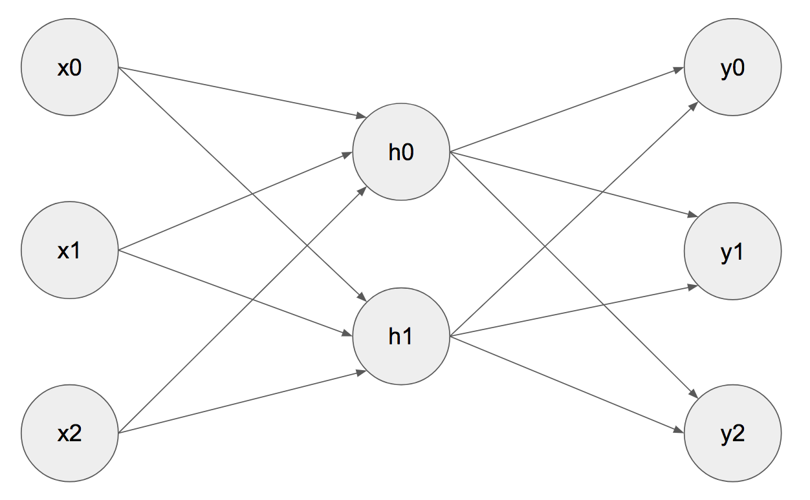
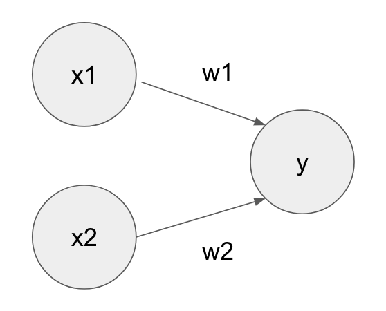
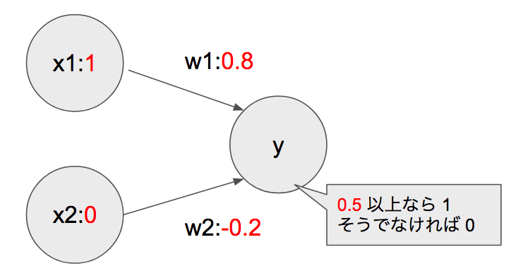
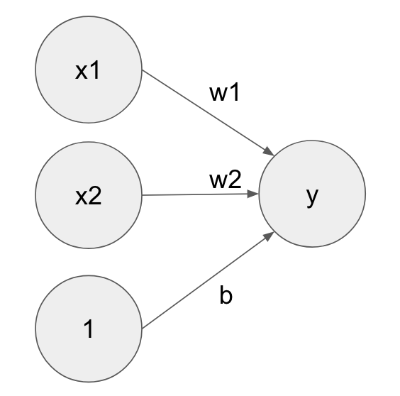

# 3 ニューラルネットワーク

ニューラルネットワークは機械学習の手法の一つで、人間の脳のニューロンが信号を受け渡して記憶・学習する仕組みをコンピューター上で再現することを目標として作られた数学モデルです。脳科学の発展と、ニューラルネットワーク研究の発展により、現在のニューラルネットワークは脳の再現からは離れてしまっていますが、機械学習分野では非常に精度の高い方法として広く活用されています。



本章ではニューラルネットワークの全体像を学ぶ前に、ニューラルネットワークを構成する一つひとつのノードの仕組みについて学習します。機械学習の文脈におけるこれらのノードは、形式ニューロンなどと呼ばれます。

> 以降はノード（形式ニューロン）のことを単純にニューロンと呼びます。

<div style="page-break-before:always"></div>

## 3.1 ニューロンの仕組み

ニューロンは複数の入力信号を受け付け、出力信号を返します。




> ここでは 図の y のニューロンについて考えます。

上記の図に示すようにニューロンはそれぞれの入力信号（x1, x2）に対して、重み（w1, w2）を掛け合わせて処理します。その結果が閾値を超えた場合に出力信号（y）を返します。

たとえば入力信号を x1=1, x2=0 とし、それぞれの重みを w1=0.8, w2=-0.2、閾値を 0.5 とした場合、Pythonプログラムで次のように実装できます。



```python
def neuron(x1, x2):
    w1 = 0.8
    w2 = -0.2
    y = w1 * x1 + w2 * x2
    if y > 0.5 :
        return 1
    else :
        return 0

print(neuron(1, 0))
```

上記の場合、実行結果に 1 が出力されます。

<div style="page-break-before:always"></div>

入力信号を変更してみましょう。x1=0, x2=1 とするとどうでしょうか。

```python
print(neuron(0, 1))
```

上記の場合、実行結果に 0 が出力されます。

このようにニューロンはシンプルな構造ですが、入力信号と重み、閾値によって出力結果を決定することができます。

> ここで紹介したニューロンは、パーセプトロンと呼ばれることもあります。パーセプトロンは複数の入力信号を処理して、一つの出力信号を返すアルゴリズムです。パーセプトロンはニューラルネットワークのベースとなる考え方です。

<div style="page-break-before:always"></div>


### バイアスの導入

ここであとのニューラルネットワークの学習をスムーズに進めるために、閾値をバイアスという表現に変更します。



> バイアスは常に入力信号があるので 1 としています。

```python
def neuron(x1, x2):
    w1 = 0.8
    w2 = -0.2
    b = -0.5
    y = w1 * x1 + w2 * x2 + b
    if y > 0 :
        return 1
    else :
        return 0

print(neuron(1, 0))
print(neuron(0, 1))
```

上記のプログラムでは変数 b がバイアスです。バイアスを導入することで、出力信号の条件式が0より大きいかというシンプルな実装になりました。

ここで定義した重みやバイアスは、教師ありデータを学習することで微調整していくことになります。

<div style="page-break-before:always"></div>

### リファクタリング NumPy配列による実装

本題から外れますが、NumPy配列を使った実装を見てみましょう。ここでは入力信号、重みをNumPy配列で定義しています。

```python
import numpy as np

def neuron(x):
    w = np.array([0.8, -0.2])
    b = -0.5
    y = w.dot(x) + b
    if y > 0 :
        return 1
    else :
        return 0

print(neuron(np.array([1, 0])))
print(neuron(np.array([0, 1])))
```

入力信号、重みをNumPy配列で表現したことで、入力信号や重みの数の増減に対応しやすくなります。


<div style="page-break-before:always"></div>

## 3.2 ニューラルネットワークの構成要素

改めてニューラルネットワークを見てみましょう。以下の図のように構成されます。


左から順に入力層（x0,x1,x2）、隠れ層（h0, h1）、出力層（y0,y1,y2）と呼びます。

ニューラルネットワークは複数のニューロンによって構成されています。ニューラルネットワークを流れる信号（データ）は、各ニューロンの持つ重みとバイアスによって制御され出力信号を形成していきます。


<div style="page-break-before:always"></div>


以降はニューラルネットワークの仕組みについて、以下の構成要素を確認しながらプログラミングしていきます。

+ 活性化関数
  + sigmoid関数
  + softmax関数
+ 損失関数
  + 2乗和誤差
  + クロスエントロピー誤差
+ 最適化処理
  + 勾配法
