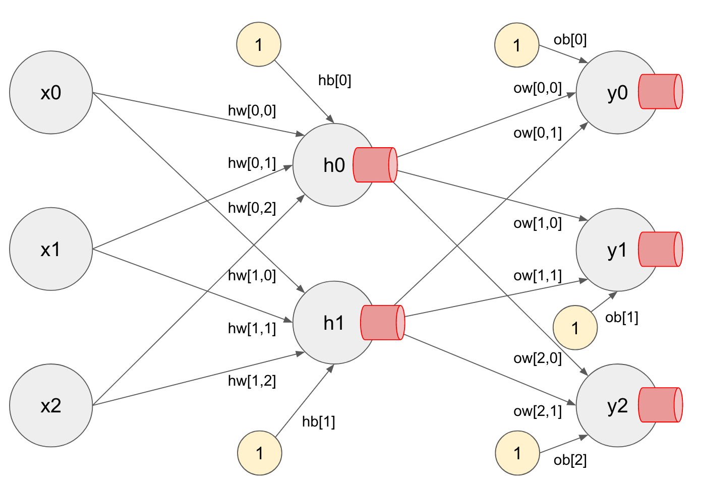
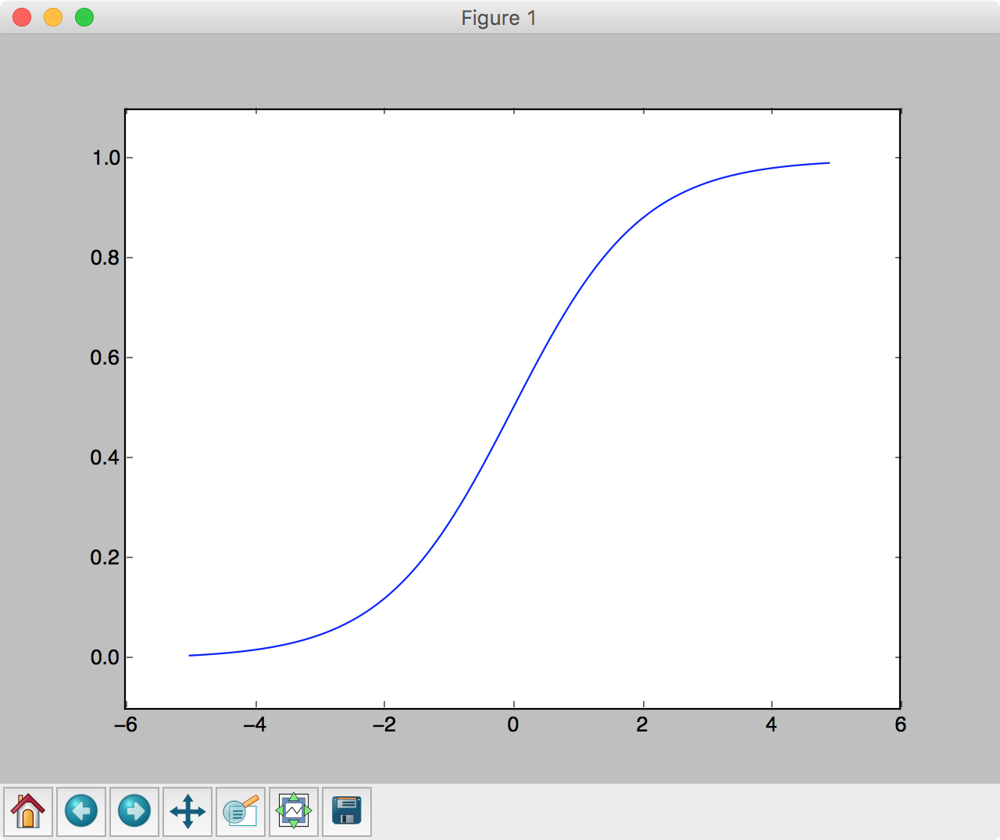
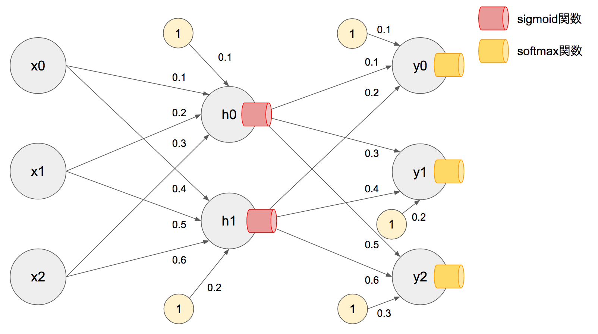

## 3.3 ニューラルネットワークの実装 - PART1

ニューラルネットワークは複数の入力信号を受け取り、出力信号を出力するプログラムです。入力信号を受け取ってから、重みやバイアスによる演算以外にも、活性化関数と呼ばれる仕組みを活用します。

+ 活性化関数
  + sigmoid関数
  + softmax関数


## 3.4 活性化関数

活性化関数は出力信号の活性化を制御する関数です。前節で紹介したニューロンの場合、出力信号は 1, 0 のいずれかに限定されてしまいます。活性化関数はこの出力信号を制御します。



> 図の赤い筒状の部品が活性化関数です。活性化関数は出力信号を制御します。


<div style="page-break-before:always"></div>

### sigmoid関数

sigmoid関数は出力信号を 0〜1 の範囲に変換する関数です。Pythonプログラムで次のように実装できます。

```python
def sigmoid(x):
    return 1 / (1 + np.exp(-x))
```

sigmoid関数の実行結果を確認するためにmatplotlibを使ってグラフに出力してみましょう。


```python
import numpy as np
import matplotlib.pyplot as plt

def sigmoid(x):
    return 1 / (1 + np.exp(-x))

x = np.arange(-5, 5, 0.1)
y = sigmoid(x)

plt.plot(x, y)
plt.ylim(-0.1, 1.1)
plt.show()
```

プログラムを実行すると次のような結果を確認できるでしょう。



> sigmoid関数は入力（x）が 0 のとき、出力は0.5となります。

<div style="page-break-before:always"></div>


それでは確認のため前節で実装したニューロン（neuron関数）にsigmoid関数を適用してみましょう。次のように実装できます。

```python
import numpy as np

def sigmoid(x):
    return 1 / (1 + np.exp(-x))

def neuron(x):
    w = np.array([0.8, -0.2])
    b = -0.5
    y = sigmoid(w.dot(x) + b)
    return y

print(neuron(np.array([1, 0])))
print(neuron(np.array([0, 1])))
```

プログラムを実行すると次のような結果を確認できるでしょう。結果が0〜1の間の値に置き換えられているのがわかります。

```
0.574442516812
0.331812227832
```

ニューラルネットワークでは、隠れ層の出力信号にsigmoid関数などの活性化関数を適用します。sigmoid関数によって出力信号が0, 1に限定されなくなることで、出力信号の表現が柔軟になります。

> 隠し層で使う活性化関数にはsigmoid関数以外にもrelu関数、tanh関数などが存在します。

<div style="page-break-before:always"></div>


### softmax関数

softmax関数は出力層の出力信号を確率（パーセンテージ）に変換する関数です。Pythonプログラムで次のように実装できます。

```python
def softmax(x):
    return np.exp(x) / np.sum(np.exp(x))
```

> 引数 x にはNumPy配列を受け取ります。

softmax関数の実行結果を確認してみましょう。

```python
import numpy as np

def softmax(x):
    return np.exp(x) / np.sum(np.exp(x))

print(softmax(np.array([0.9, 0.2, 0.6])))
print(softmax(np.array([0.8, 0.1, 0.8])))
```

プログラムの実行結果は次のようになるでしょう。

```
[ 0.44694665  0.22194714  0.33110622]
[ 0.4005471  0.1989058  0.4005471]
```

softmax関数の結果の総和は 1 になるという特徴があります。そのため、出力層の各ニューロンの出力信号を確率（パーセンテージ）として扱うことができます。


> 出力層で使う活性化関数にはsoftmax関数以外にも、恒等関数を使うこともあります。恒等関数は入力値を加工せずそのまま出力する関数です。ニューラルネットワークの用途が分類目的であればsoftmax関数、回帰の場合は恒等関数を使うと良いでしょう。

<div style="page-break-before:always"></div>


### これまでのまとめ

ニューラルネットワークは入力信号に対して、重みとバイアスを考慮し、出力信号を出力するプログラムです。隠れ層の出力にはsigmoid関数のような活性化関数、出力層の出力にはsoftmax関数のような活性化関数を使います。

これらの構成要素を活用して、次の図のようなニューラルネットワークを実装してみましょう。



<div style="page-break-before:always"></div>

```python
import numpy as np

class NeuralNetwork:

    def __init__(self):
        self.hw = np.array([[0.1, 0.2, 0.3], [0.4, 0.5, 0.6]])
        self.hb = np.array([0.1, 0.2])
        self.ow = np.array([[0.1, 0.2], [0.3, 0.4] ,[0.5, 0.6]])
        self.ob = np.array([0.1, 0.2, 0.3])

    def sigmoid(self, x):
        return 1 / (1 + np.exp(-x))

    def softmax(self, x):
        return np.exp(x) / np.sum(np.exp(x))

    def neuron(self, w, b, x, activate):
        return activate(w.dot(x) + b)

    def input(self, x):
        hy = self.neuron(self.hw, self.hb, x, self.sigmoid)
        y = self.neuron(self.ow, self.ob, hy, self.softmax)
        return y

nn = NeuralNetwork()
x = np.array([0.5, 0.6, 0.7])
print(nn.input(x))
```

プログラムの実行結果は次のようになるでしょう。

```
[ 0.21890075  0.3182909   0.46280836]
```

ニューラルネットワークの構成要素の一つである活性化関数について学習しました。以降は、ニューラルネットワークの出力データと、教師データを比較して重みやバイアスを調整していく方法を見ていきましょう。
