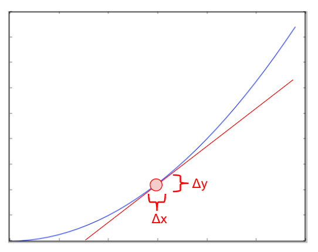
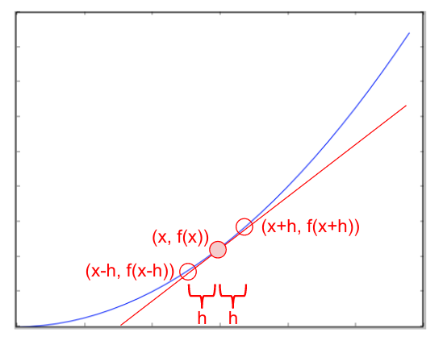
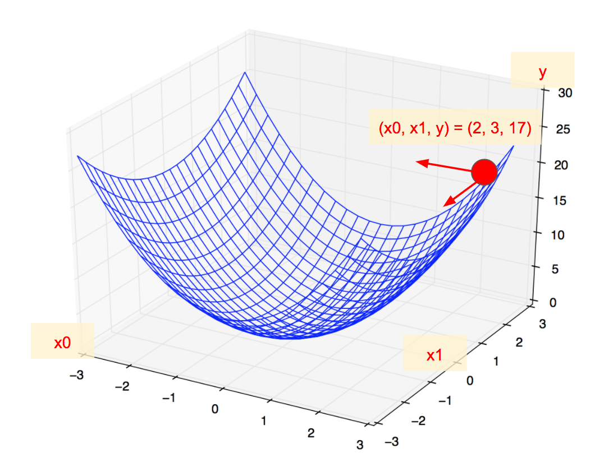
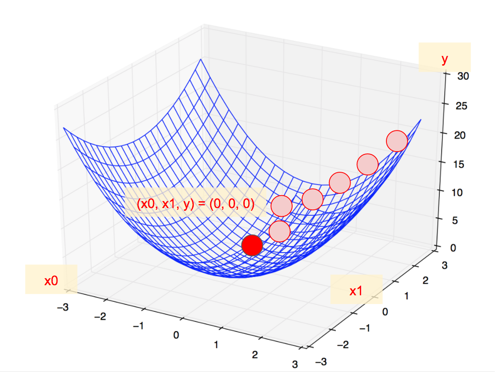

## 3.7 ニューラルネットワークの実装 - PART3

最適化処理は損失関数の結果をもとに、ニューラルネットワークのもつ重みやバイアスを最適化していく仕組みです。ここでは勾配法を取り上げます。

+ 最適化処理
  + 勾配法


## 3.8 最適化処理

ここでは勾配法の学習に入る前に微分について復習しておきましょう。

### 微分

微分とは、変数 x に微小な変化（Δx）が発生したときに、出力である y の変化量（Δy）を求めることです。あるいは変化量そのものを意味します。



> 変化量とは図の Δy / Δx にあたります。たとえば Δx が 1で Δ y が 2 の場合は変化量は2になります。

プログラムにおいて微分を求めるにはいくつかの方法がありますが、ここでは中心差分と呼ばれる技法を用います。




Pythonで微分を求めるには次のように実装できます。


```python
def diff(f, x):
    h = 1e-4
    return (f(x + h) - f(x - h)) / (2 * h)
```

ここでは微分を求めるdiff関数を定義しています。第1引数には微分を求める対象となる関数を指定します。

> 前方差分という技法で微分を求める場合、(f(x + h) - f(x)) / h と実装することもできます。

それでは実際に微分を試してみましょう。ここでは my_func関数 y = 2 \* x\*\*2 + x + 1 の微分について考えます。x=1.0、x=2.0における変化量を求めてみましょう。

> 参考までに数式の展開によって求められる導関数は dy/dx = 4x + 1 となります。導関数より、x=1.0 の場合 5、x=2.0 の場合 9 となります。

```python
import numpy as np

def diff(f, x):
    h = 1e-4
    return (f(x + h) - f(x - h)) / (2 * h)

def my_func(x):
    y = 2 * x**2 + x + 1
    return y

print(diff(my_func, 1.0))
print(diff(my_func, 2.0))
```


プログラムの実行結果は次のようになるでしょう。

```
4.999999999997229
9.00000000000567
```

微小な誤差はあるものの期待値である5, 9に近い値が出力されているのがわかります。


<div style="page-break-before:always"></div>


### 偏微分

続いて偏微分について確認してみましょう。偏微分とは多変数関数に対して、1つの変数のみに絞って微分することです。
具体的には、変数 x0、変数 x1 が2つあるようなケースです。偏微分では変数 x0 の偏微分を求めるときには、変数 x1 の値を固定するようにします。同様に変数 x1 の偏微分を求めるときには、変数 x0 の値を固定するようにします。

ここでは y = 2 \* x0\*\*2 + x1\*\*2 ついて考えてみましょう。x0=2, x1=3のケースにおいて、x0の偏微分、x1の偏微分を求めてみましょう。

> 参考までに数式の展開によって求められる導関数は ∂y/∂x0 = 4 * x0、∂y/∂x1 = 2 * x1 となります。導関数より、x0=2 の場合 8、x1=3 の場合 6 となります。

```python
import numpy as np

def my_func(x0, x1):
    y = 2 * x0**2 + x1**2
    return y

def part_diff(f, x0, x1):
    h = 1e-4
    y0 = (f(x0 + h, x1) - f(x0 - h, x1)) / (2 * h)
    y1 = (f(x0, x1 + h) - f(x0, x1 - h)) / (2 * h)
    return [y0, y1]

x0 = 2.0
x1 = 3.0
print(part_diff(my_func, x0, x1))
```

プログラムの実行結果は次のようになるでしょう。

```
[7.999999999999119, 6.00000000000378]
```

期待値である 8 と 6 に近い結果を確認することができました。

<div style="page-break-before:always"></div>

### 勾配

次に勾配を求めてみましょう。勾配とは各変数の偏微分を一つのベクトルにまとめたものです。つまり、先ほどの偏微分を求めるプログラムも勾配を求めていると言えます。

ここでは、さきほどのプログラムを修正して、変数x0, x1・・・xnと処理できるようにNumPy配列で再実装してみましょう。

> 先ほどの偏微分と同じケースを扱います。ここでは y = 2 \* x0\*\*2 + x1\*\*2 について考えてみましょう。x0=2, x1=3のケースにおいて、x0の偏微分、x1の偏微分を勾配ベクトルとして出力します。my_funcの実装もNumPy配列を引数にとるように修正しています。


```python
import numpy as np

def my_func(x):
    y = 2 * x[0]**2 + x[1]**2
    return y

def grad(f, x):
    h = 1e-4
    y = np.zeros_like(x)
    for i in range(x.size):
        t = x[i]

        x[i] = t + h
        ya = f(x)
        x[i] = t - h
        yb = f(x)
        y[i] = (ya - yb) / (2 * h)

        x[i] = t
    return y

x = np.array([2.0, 3.0])
print(grad(my_func, x))
```

プログラムの実行結果は次のようになるでしょう。

```
[ 8.  6.]
```

期待値である 8 と 6 をベクトル（NumPy配列）として確認することができました。

<div style="page-break-before:always"></div>


### 勾配法

勾配法は、勾配を使って関数の最小値（あるいは最大値）を求める手法です。




勾配とは偏微分をベクトルとしてまとめたものでした。またベクトルを構成する偏微分は各変数の変化量を表しています。先ほどのケースの場合を考えてみましょう。y = 2 \* x0\*\*2 + x1\*\*2 という関数において、x0=2, x1=3の地点で次の勾配を求めることができました。

```
[ 8.  6.]
```

これは x0 が変化するときの y の変化量 は 8 であり、x1 が変化するときの y の変化量 は 6 であることを示しています。x0=2, x1=3の地点においては、x0、x1のいずれも増加すると y は増加する傾向にあると言えます。逆にいうと、x0=2, x1=3の地点において、x0、x1 のいずれも減少すると y も減少すると言えます。


> 最小値を求めるものを勾配降下法と呼びます。最大値を求めるものを勾配上昇法と呼びます。

<div style="page-break-before:always"></div>


ここでは関数 y = 2 \* x0\*\*2 + x1\*\*2 の結果が最小となる x0、x1 を求めるというのが勾配降下法の狙いです。先に説明したとおり、x0=2, x1=3の地点において、x0、x1 が減少すると y は減少します。それでは具体的にx0、x1をどれだけ減少させると良いのでしょうか。

ここで学習率（Learning Rate）という値を使います。学習率には0.01や0.1といった数値を指定します。勾配に学習率を掛け合わせて、x0, x1 の値の変化を確定します。

それでは具体的に見てみましょう。ある地点（たとえばx0=2, x1=3の地点）において、勾配と学習率を使って、最小方向に向かって小さく移動します。次に移動後の地点において再度、勾配を求めます。求めた勾配をもとに移動方向を決定し、学習率を掛け合わせて移動する、というステップを繰り返します。



> 学習率が大きすぎると最小地点を飛び越えてしまうこともあります。一方で学習率が小さすぎると計算回数が多くなり、最小地点にたどり着かない、ということになります。

<div style="page-break-before:always"></div>


それでは実際にプログラミングしてみましょう。次のプログラムでは学習率（lr）に0.1、繰り返し数（step）に10を指定しています。

```python
import numpy as np

def my_func(x):
    y = 2 * x[0]**2 + x[1]**2
    return y

def grad(f, x):
    h = 1e-4
    y = np.zeros_like(x)
    for i in range(x.size):
        t = x[i]

        x[i] = t + h
        ya = f(x)
        x[i] = t - h
        yb = f(x)
        y[i] = (ya - yb) / (2 * h)

        x[i] = t
    return y

step = 10
lr = 0.1

x = np.array([2.0, 3.0])
for i in range(step):
    x -= lr * grad(my_func, x)
    print(x)
```

プログラムの実行結果は次のようになります。

```
[ 1.2  2.4]
[ 0.72  1.92]
[ 0.432  1.536]
[ 0.2592  1.2288]
[ 0.15552  0.98304]
[ 0.093312  0.786432]
[ 0.0559872  0.6291456]
[ 0.03359232  0.50331648]
[ 0.02015539  0.40265318]
[ 0.01209324  0.32212255]
```

x0、x1ともに0に近づいているのがわかります。関数（y = 2 \* x[0]\*\*2 + x[1]\*\*2）の最小値は、x0=0、x1=0の地点であるため、期待通りに動作しているのがわかります。

> 最適化処理として勾配降下法を取り上げました。勾配降下法をベースに考案されているアルゴリズムにSGD、Adagradなどがあります。

<div style="page-break-before:always"></div>

### これまでのまとめ

ニューラルネットワークの損失関数の出力結果を最小にするためには勾配降下法を使います。実際には教師ありの訓練データを用意し、損失関数が最小になるように、ニューラルネットワークの持つ重みやバイアスを勾配と学習率を使って更新していくようにします。

それでは実際にニューラルネットワークのプログラムを続きを作成してみましょう。既存のNeuralNetworkクラスを以下のとおり修正します。

+ 勾配を求めるgradメソッドを追加
  + ただし、1次元配列（バイアス）、2次元配列（重み）を処理できるよう修正する(grad_2dimメソッドを追加)
+ 訓練データを処理するtrainメソッドを追加
+ テストデータを処理するtestメソッドを追加

<div style="page-break-before:always"></div>


```python
import numpy as np

class NeuralNetwork:

    def __init__(self):
        self.hw = np.array([[0.1, 0.2, 0.3], [0.4, 0.5, 0.6]])
        self.hb = np.array([0.1, 0.2])
        self.ow = np.array([[0.1, 0.2], [0.3, 0.4] ,[0.5, 0.6]])
        self.ob = np.array([0.1, 0.2, 0.3])

    def sigmoid(self, x):
        return 1 / (1 + np.exp(-x))

    def softmax(self, x):
        return np.exp(x) / np.sum(np.exp(x))

    def neuron(self, w, b, x, activate):
        return activate(w.dot(x) + b)

    def cross_entropy(self, y, t):
        delta = 1e-7
        return -np.sum(t * np.log(y + delta))

    def input(self, x, t):
        hy = self.neuron(self.hw, self.hb, x, self.sigmoid)
        y = self.neuron(self.ow, self.ob, hy, self.softmax)
        loss = self.cross_entropy(y, t)
        return loss

    def grad(self, f, x):
        h = 1e-4
        y = np.zeros_like(x)
        for i in range(x.size):
            t = x[i]

            x[i] = t + h
            ya = f(x)
            x[i] = t - h
            yb = f(x)
            y[i] = (ya - yb) / (2 * h)

            x[i] = t
        return y

    def grad_2dim(self, f, x):
        result = np.zeros_like(x)
        for i, x in enumerate(x):
            result[i] = self.grad(f, x)
        return result

    def train(self, x, t, lr=0.1):
        loss = lambda n: self.input(x, t)

        grads = {}
        grads['hw'] = self.grad_2dim(loss, self.hw)
        grads['hb'] = self.grad(loss, self.hb)
        grads['ow'] = self.grad_2dim(loss, self.ow)
        grads['ob'] = self.grad(loss, self.ob)

        self.hw -= lr * grads['hw']
        self.hb -= lr * grads['hb']
        self.ow -= lr * grads['ow']
        self.ob -= lr * grads['ob']

    def test(self, x, t):
        hy = self.neuron(self.hw, self.hb, x, self.sigmoid)
        y = self.neuron(self.ow, self.ob, hy, self.softmax)
        return (np.argmax(y) == np.argmax(t)).astype('int')


nn = NeuralNetwork()
x_train = np.array([[0.5, 0.6, 0.7], [0.6, 0.7, 0.8], [0.7, 0.8, 0.9]])
y_train = np.array([[0, 0, 1], [0, 1, 0], [1, 0, 0]])

x_test = np.array([[0.1, 0.2, 0.3], [0.4, 0.5, 0.6], [0.7, 0.8, 0.9]])
y_test = np.array([[0, 0, 1], [0, 0, 1], [1, 0, 0]])

for i in range(x_train.shape[0]):
    nn.train(x_train[i], y_train[i])

correct = 0
for i in range(x_test.shape[0]):
    correct += nn.test(x_test[i], y_test[i])

print("Accuracy: {}".format(correct / x_test.shape[0]))
```

上記のプログラムはダミーデータを使っているため、出力結果は次のようになります。

```
Accuracy: 0.6666666666666666
```

<div style="page-break-before:always"></div>

trainメソッド、testメソッドについて補足しておきましょう。

まずは訓練データで学習を行うtrainメソッドです。

```python
def train(self, x, t, lr=0.1):
    loss = lambda n: self.input(x, t)

    grads = {}
    grads['hw'] = self.grad_2dim(loss, self.hw)
    grads['hb'] = self.grad(loss, self.hb)
    grads['ow'] = self.grad_2dim(loss, self.ow)
    grads['ob'] = self.grad(loss, self.ob)

    self.hw -= lr * grads['hw']
    self.hb -= lr * grads['hb']
    self.ow -= lr * grads['ow']
    self.ob -= lr * grads['ob']
```

trainメソッドでは損失関数の出力を求めるラムダ式を定義しています。

```python
loss = lambda n: self.input(x, t)
```

ここでは入力データと教師データの値からクロスエントロピー誤差を出力するinputメソッド呼び出しを定義しています。ラムダ式は後のgradメソッドの中で呼び出されます。

> ラムダ式の引数 n は本来不要ですが、既存のgradメソッドを再利用するために引数を受け取るようにしています。

次に重みとバイアスの勾配を求めます。

```python
grads = {}
grads['hw'] = self.grad_2dim(loss, self.hw)
grads['hb'] = self.grad(loss, self.hb)
grads['ow'] = self.grad_2dim(loss, self.ow)
grads['ob'] = self.grad(loss, self.ob)
```

次に求めた勾配に学習率を掛け合わせて、重みとバイアスを調整しています。

```python
self.hw -= lr * grads['hw']
self.hb -= lr * grads['hb']
self.ow -= lr * grads['ow']
self.ob -= lr * grads['ob']
```

<div style="page-break-before:always"></div>


続いてtestメソッドです。訓練データで学習済みのニューラルネットワークをテストするためのメソッドです。

```python
def test(self, x, t):
    hy = self.neuron(self.hw, self.hb, x, self.sigmoid)
    y = self.neuron(self.ow, self.ob, hy, self.softmax)
    return (np.argmax(y) == np.argmax(t)).astype('int')
```

引数で受け取ったテストデータ（x）から予測結果（y）を求めています。また引数で受け取った教師データ（t）と予測結果を比較し、予測が正しかった場合は1、不正解だった場合は0を返すようにしています。

次は具体的なデータを使ってニューラルネットワークを実装してみましょう。

<div style="page-break-before:always"></div>
