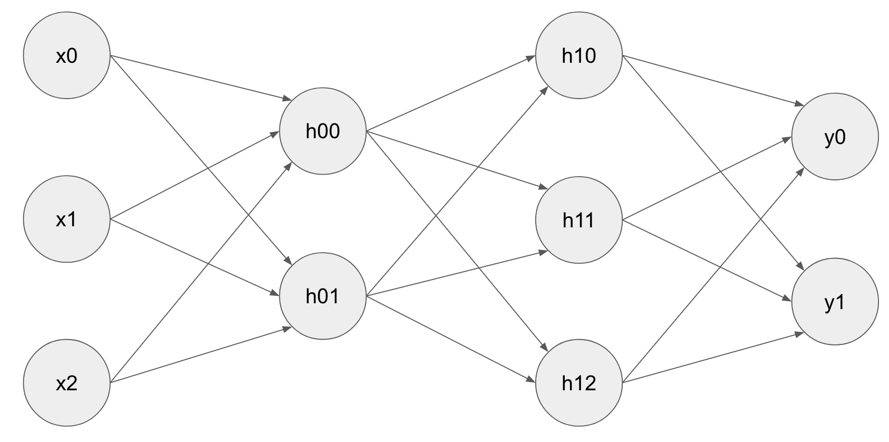
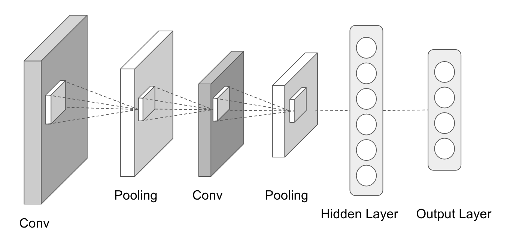
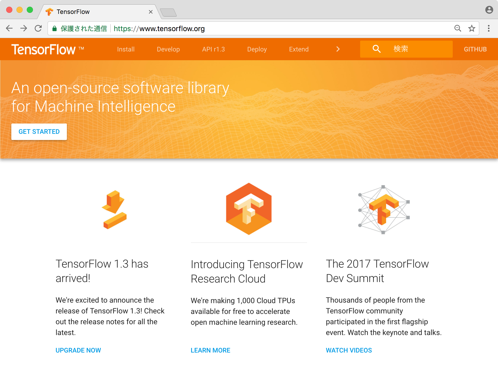
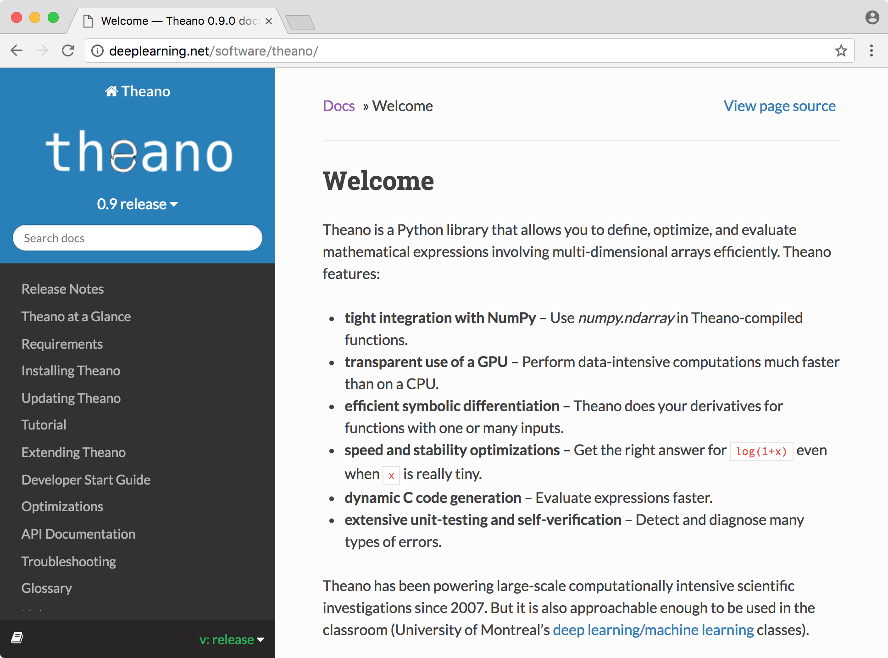
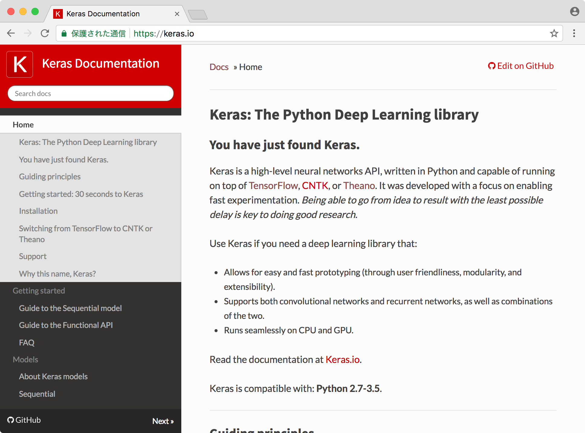

# 4 ディープラーニング

ニューラルネットワークの中でも多層構造のニューラルネットワークをDeepニューラルネットワーク（DNN）といい、これを機械学習に流用したのがDeepLearningです。ニューラルネットワークには幾つかの種類がありますが、ここでは代表的な3種類を、利用例を合わせて紹介します。

## 4.1 ディープラーニングの分類

### FeedForward Neural Network（FFNN）

フィードフォワードニューラルネットワークは日本語では「順伝播型ニューラルネットワーク」と言います。入力層から中間層、中間層から出力層と上から順番に一方向に情報が伝達され、各々の層の全てのノードが結合されているニューラルネットワークのモデルです。最初に発明されたニューラルネットワークで最もシンプルであることが特徴です。全てのニューラルネットワークの基礎となっています。

> 前章のニューラルネットワークの隠し層を増やしたものと考えると良いでしょう。

### Convolutional Neural Network（CNN）

コンボリューショナルニューラルネットワークは日本語で「畳み込みニューラルネットワーク」と言います。情報の伝達はFFNNと同様に順伝播型ですが、情報を圧縮（＝畳み込み）してノード間の重みをつけます。その結果、ノード間の結合が全てではなく、不要な一部の結合が切断されるモデルです。CNNは画像処理、画像判別で使用されるニューラルネットワークです。

### Recurrent Neural Network（RNN）

FNNやCNNは学習の対象となる情報間に相関がなく、独立したデータは学習できるのですが、時系列データのような情報間に相関のある情報を扱うことができませんでした。この問題を解消したモデルがリカレントニューラルネットワークです。前の情報の出力層の結果を、次の情報の入力層に戻すことで、情報間に関係をもたせることができます。

## 4.2 開発言語とライブラリ

ディープラーニングの分野で多く用いられるプログラミング言語がPythonです。Pythonには機械学習ライブラリが充実しており、ディープラーニングをサポートするライブラリも多く登場しています。ディープラーニングを活用してAIを開発する場合、これらのライブラリを活用することで開発効率を高めることができるでしょう。ここでは以下の3つのフレームワークを紹介します。

### TensorFlow

TensorFlowは機械学習向けのオープンソースソフトウェアライブラリです。TensorFlowはもともと機械学習やニューラルネットワークを研究する目的でGoogleの研究機関によって開発されました。TensorFlowはデータフローグラフという仕組みを活用した数値計算用のライブラリです。グラフを構成するノードは算術演算を表し、グラフのエッジはノード間でやりとりされる多次元データ配列（テンソル）を表します。TensorFlowは柔軟なアーキテクチャを採用しているため、デスクトップやサーバ、モバイルデバイス上のCPU、またはGPUを使って動作することができます。

https://www.tensorflow.org/

### Theano

Theanoは数値計算ライブラリです。多次元配列を効率良く使用する数式を定義し、最適化、評価を行うことができます。NumPy配列との相性も良く、GPUでの実行もサポートしています。Theanoは2007年、モントリオール大学のDeep Learning/機械学習クラスで開発されました。

http://deeplearning.net/software/theano/

### Keras

KerasはDeep Learning用のライブラリです。ニューラルネットワークを構成するための抽象度の高いAPIを提供します。Kerasの実体はTensorFlowやTheano、CNTKのラッパーライブラリです。KerasのAPIを通じて、TensorFlowやTheanoを動かすことができます。

https://keras.io/

本講座ではDeep Learningの実装をサポートするKerasを重点的に取り上げます。
