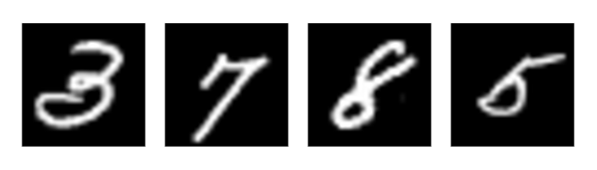
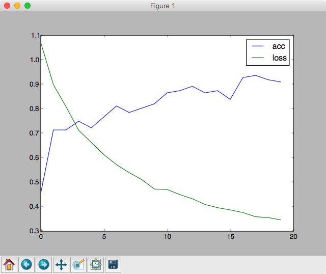

## 4.3 Kerasチュートリアル - 1 Keras入門

まずはダミーデータを用意してKerasを動かしてみましょう。このプログラムは入力層、隠れ層、出力層で構成したニューラルネットワークです。具体的には以下の構成に従って実装しています。

|項目|値|
|:--|:--|
|入力層|ニューロン数：3|
|隠れ層|ニューロン数：2、活性化関数：sigmoid関数|
|出力層|ニューロン数：3、活性化関数：softmax関数|
|損失関数|多クラス-クロスエンロピー誤差（categorical_crossentropy）|
|オプティマイザー|確率的勾配降下法（SGD）|


```python
import numpy as np
from keras.models import Sequential
from keras.layers.core import Dense, Activation

x_train = np.array([[0.1, 0.2, 0.3], [0.4, 0.5, 0.6], [0.7, 0.8, 0.9]])
y_train = np.array([[0, 0, 1], [0, 1, 0], [1, 0, 0]])

x_test = np.array([[0.1, 0.3, 0.5]])
y_test = np.array([[0, 0, 1]])

model = Sequential()
model.add(Dense(2, input_dim=3))
model.add(Activation('sigmoid'))
model.add(Dense(3))
model.add(Activation('softmax'))
model.compile(optimizer='SGD', loss='categorical_crossentropy', metrics=['accuracy'])

model.fit(x_train, y_train)

print(model.evaluate(x_test, y_test, verbose=0))
```

<div style="page-break-before:always"></div>

プログラムを実行すると以下のようになるでしょう。

```
Using TensorFlow backend.
Epoch 1/10
2017-08-24 21:12:39.326359: W tensorflow/core/platform/cpu_feature_guard.cc:45] The TensorF
low library wasn't compiled to use SSE4.1 instructions, but these are available on your mac
hine and could speed up CPU computations.
2017-08-24 21:12:39.326381: W tensorflow/core/platform/cpu_feature_guard.cc:45] The TensorF
low library wasn't compiled to use SSE4.2 instructions, but these are available on your mac
hine and could speed up CPU computations.
2017-08-24 21:12:39.326386: W tensorflow/core/platform/cpu_feature_guard.cc:45] The TensorF
low library wasn't compiled to use AVX instructions, but these are available on your machin
e and could speed up CPU computations.
2017-08-24 21:12:39.326391: W tensorflow/core/platform/cpu_feature_guard.cc:45] The TensorF
low library wasn't compiled to use AVX2 instructions, but these are available on your machi
ne and could speed up CPU computations.
2017-08-24 21:12:39.326395: W tensorflow/core/platform/cpu_feature_guard.cc:45] The TensorF
low library wasn't compiled to use FMA instructions, but these are available on your machin
e and could speed up CPU computations.
3/3 [==============================] - 0s - loss: 1.2110 - acc: 0.3333
Epoch 2/10
3/3 [==============================] - 0s - loss: 1.2101 - acc: 0.3333
Epoch 3/10
3/3 [==============================] - 0s - loss: 1.2091 - acc: 0.3333
Epoch 4/10
3/3 [==============================] - 0s - loss: 1.2082 - acc: 0.3333
Epoch 5/10
3/3 [==============================] - 0s - loss: 1.2073 - acc: 0.3333
Epoch 6/10
3/3 [==============================] - 0s - loss: 1.2064 - acc: 0.3333
Epoch 7/10
3/3 [==============================] - 0s - loss: 1.2055 - acc: 0.3333
Epoch 8/10
3/3 [==============================] - 0s - loss: 1.2046 - acc: 0.3333
Epoch 9/10
3/3 [==============================] - 0s - loss: 1.2038 - acc: 0.3333
Epoch 10/10
3/3 [==============================] - 0s - loss: 1.2029 - acc: 0.3333
[1.7369792461395264, 0.0]
```

<div style="page-break-before:always"></div>

出力結果について見ていきましょう。出力結果の1行目で、内部で使うエンジンが出力されています。

```
Using TensorFlow backend.
```

内部でTensorFlowが動いていることがわかります。

次にエポック数の出力があります。

```
Epoch 1/10
```

Kerasはデフォルトで10エポック繰り返すようになっています。次のようにmodel.fitメソッドの呼び出し時にエポック数を指定することもできます。

```python
model.fit(x_train, y_train, epochs=2)
```

<div style="page-break-before:always"></div>

次に警告メッセージがいくつか出力されています。

```
2017-08-24 21:12:39.326359: W tensorflow/core/platform/cpu_feature_guard.cc:45] The TensorF
low library wasn't compiled to use SSE4.1 instructions, but these are available on your mac
hine and could speed up CPU computations.
2017-08-24 21:12:39.326381: W tensorflow/core/platform/cpu_feature_guard.cc:45] The TensorF
low library wasn't compiled to use SSE4.2 instructions, but these are available on your mac
hine and could speed up CPU computations.
2017-08-24 21:12:39.326386: W tensorflow/core/platform/cpu_feature_guard.cc:45] The TensorF
low library wasn't compiled to use AVX instructions, but these are available on your machin
e and could speed up CPU computations.
2017-08-24 21:12:39.326391: W tensorflow/core/platform/cpu_feature_guard.cc:45] The TensorF
low library wasn't compiled to use AVX2 instructions, but these are available on your machi
ne and could speed up CPU computations.
2017-08-24 21:12:39.326395: W tensorflow/core/platform/cpu_feature_guard.cc:45] The TensorF
low library wasn't compiled to use FMA instructions, but these are available on your machin
e and could speed up CPU computations.
```

これは、CPUの拡張命令が使われておらず、通常のCPUによって処理されていることを出力しています。

> Kerasの使い方を学び始める際に上記の警告メッセージは無視しておいて構いません。

<div style="page-break-before:always"></div>

次に各エポックごとの出力が続きます。

```
3/3 [==============================] - 0s - loss: 1.2110 - acc: 0.3333
Epoch 2/10
3/3 [==============================] - 0s - loss: 1.2101 - acc: 0.3333
Epoch 3/10
3/3 [==============================] - 0s - loss: 1.2091 - acc: 0.3333
Epoch 4/10
3/3 [==============================] - 0s - loss: 1.2082 - acc: 0.3333
Epoch 5/10
3/3 [==============================] - 0s - loss: 1.2073 - acc: 0.3333
Epoch 6/10
3/3 [==============================] - 0s - loss: 1.2064 - acc: 0.3333
Epoch 7/10
3/3 [==============================] - 0s - loss: 1.2055 - acc: 0.3333
Epoch 8/10
3/3 [==============================] - 0s - loss: 1.2046 - acc: 0.3333
Epoch 9/10
3/3 [==============================] - 0s - loss: 1.2038 - acc: 0.3333
Epoch 10/10
3/3 [==============================] - 0s - loss: 1.2029 - acc: 0.3333
```

上記の出力はmain.tarinメソッドの呼び出しによって出力されます。Kerasはエポックごとの進捗を視覚的にわかりやすく表示してくれます。

> model.fit(x_train, y_train, verbose=0)とすることで進捗を非表示にすることもできます。

出力に含まれるlossは損失関数の出力を表します。うまく学習が進むと損失関数の出力結果は現象していくようになります。出力にはaccという項目も含まれています。これは教師データの正答率（精度）を表しています。ここでは訓練時に33%の正答率で止まっていることがわかります。

> ダミーデータで動かしているため、このような数値となります。

最後に次の1行が出力されています。

```
[1.7369792461395264, 0.0]
```

これは print(model.evaluate(x_test, y_test, verbose=0)) の出力結果です。つまりテストデータによる検証結果を表しています。出力の先頭要素はテストデータに対する損失関数の出力です。2番目の要素はテストデータに対する正答率（精度）です。

<div style="page-break-before:always"></div>

続いてプログラムの詳細を見てみましょう。

```python
model = Sequential()
model.add(Dense(2, input_dim=3))
model.add(Activation('sigmoid'))
model.add(Dense(3))
model.add(Activation('softmax'))
model.compile(optimizer='SGD', loss='categorical_crossentropy', metrics=['accuracy'])

model.fit(x_train, y_train)

print(model.evaluate(x_test, y_test, verbose=0))
```

Kerasはニューラルネットワーク（Deep Learning）の実装に合わせたAPIを提供します。Kerasで実装されたプログラムはニューラルネットワークを直感的に理解することができるので、開発者の人気を集めています。


```python
model = Sequential()
```

一般的なKerasのプログラムは、Sequentialオブジェクトを生成するところからスタートします。以降はSequentialオブジェクトに隠れ層や出力層を追加していく流れになります。

<div style="page-break-before:always"></div>

プログラムの続きを見てみましょう。

```python
model.add(Dense(2, input_dim=3))
model.add(Activation('sigmoid'))
```

先頭に追加したDenseオブジェクトは、全結合ニューラルネットワークレイヤーです。通常の隠れ層や出力層の定義に使います。入力層の定義は不要ですが、先頭の隠れ層にはinput_dim引数によって入力層のニューロン数を定義する必要があります。Denseオブジェクトを追加したら活性化関数を定義します。活性化関数を表すのはActivationオブジェクトです。ここでは活性化関数にsigomoid関数を指定しています。

活性化関数に指定可能な値は以下のマニュアルページで確認できます。

https://keras.io/ja/activations/

さらに続きを見てみましょう。

```python
model.add(Dense(3))
model.add(Activation('softmax'))
```

ここでは全結合ニューラルネットワークレイヤーを追加しています。結果的に最後の層になるためこれが出力層となります。出力層では3つの値に分類するので、活性化関数にsoftmax関数を指定しています。

Kerasでは各層の定義が済んだら、model.compileメソッドを呼び出します。

```python
model.compile(optimizer='SGD', loss='categorical_crossentropy', metrics=['accuracy'])
```

modelメソッドの引数には、オプティマイザー（最適化処理のアルゴリズム）を指定します。ここでは確率的勾配降下法アルゴリズム（SGD）を指定しています。またデフォルトでは学習率に0.01が設定されます。次に引数lossによって、損失関数にcategorical_crossentropyを指定しています。これによってクロスエントロピー誤差によって損失を求めることになります。また訓練時の評価尺度（metrics）に accuracy を指定しています。これによって訓練時の進捗の出力時に acc（正答率）を表示できるようになります。なお、デフォルトでは loss（損失関数の出力）のみ表示されます。

オプティマイザーに指定可能な値は以下のマニュアルページで確認できます。

https://keras.io/ja/optimizers/

同様に損失関数に指定可能な値は以下のマニュアルページで確認できます。

https://keras.io/ja/losses/

<div style="page-break-before:always"></div>

最後に訓練とテストの実行です。

```python
model.fit(x_train, y_train)

print(model.evaluate(x_test, y_test, verbose=0))
```

作成したモデルを訓練するにはfitメソッドを使います。fitメソッドには訓練データと期待値を引数で指定します。同様に訓練後のモデルをテストデータによって評価するときはevaluateメソッドを使います。

> Deep Learningでは訓練データとテストデータを分けて、モデルの精度を評価します。これはモデルの持つ汎化能力を確認するためです。

<div style="page-break-before:always"></div>

### （参考）終了時の例外メッセージについて

現行のKeras(v2.0.6)では、プログラム終了時に、次のような例外メッセージが表示される場合があります。

```
Exception ignored in: <bound method BaseSession.__del__ of <tensorflow.python.client.sessio
n.Session object at 0x11db81f60>>
Traceback (most recent call last):
  File "/Users/murayama/anaconda3/lib/python3.5/site-packages/tensorflow/python/client/sess
ion.py", line 587, in __del__
AttributeError: 'NoneType' object has no attribute 'TF_NewStatus'
```

Kerasの終了時にTensorFlowのセッションが正しく終了していないため、例外が発生しています。Kerasのプログラミングを学ぶ上では無視しておいても問題はないですが、このような例外を防ぐためには以下のコードを追加します。

```python
import keras.backend as K

# ..

K.clear_session()
```

<div style="page-break-before:always"></div>

## 4.4 Kerasチュートリアル - 2 irisデータの検証

ここではscikit-learnに含まれるiris（アヤメ）データを使ってKerasによるニューラルネットワークを評価してみましょう。

```python
from keras.models import Sequential
from keras.layers import Dense, Activation
from keras.utils import to_categorical
from sklearn.datasets import load_iris
from sklearn.model_selection import train_test_split

iris = load_iris()
x_train, x_test, y_train, y_test = train_test_split(iris.data, iris.target)

# one-hot label
y_train = to_categorical(y_train, num_classes=3)
y_test = to_categorical(y_test, num_classes=3)

model = Sequential()
model.add(Dense(50, input_dim=4))
model.add(Activation('sigmoid'))
model.add(Dense(3))
model.add(Activation('softmax'))
model.compile(optimizer='SGD', loss='categorical_crossentropy', metrics=['accuracy'])

model.fit(x_train, y_train, epochs=20, batch_size=1)

score = model.evaluate(x_test, y_test, verbose=0)
print("test acc : ", score[1])
```

プログラムを実行すると次のような結果が表示されるでしょう。

```
（省略）
Epoch 16/20
112/112 [==============================] - 0s - loss: 0.4013 - acc: 0.8571
Epoch 17/20
112/112 [==============================] - 0s - loss: 0.3892 - acc: 0.8929
Epoch 18/20
112/112 [==============================] - 0s - loss: 0.3699 - acc: 0.9107
Epoch 19/20
112/112 [==============================] - 0s - loss: 0.3653 - acc: 0.9196
Epoch 20/20
112/112 [==============================] - 0s - loss: 0.3595 - acc: 0.9196
test acc :  0.947368421053
```

最終的にはテストデータに対して、94%の正答率となっています。

<div style="page-break-before:always"></div>

プログラムの詳細を見てみましょう。

```python
from sklearn.datasets import load_iris
from sklearn.model_selection import train_test_split

iris = load_iris()
x_train, x_test, y_train, y_test = train_test_split(iris.data, iris.target)

# one-hot label
y_train = to_categorical(y_train, num_classes=3)
y_test = to_categorical(y_test, num_classes=3)
```

ここではscikit-learnに含まれるirisデータをロードして、訓練データとテストデータに分割しています。またKerasのユーティリティ関数であるto_categoricalを使って、期待値の表現をone-hotラベル表現に変換しています。

続いてモデルの定義部分を見てみましょう。

```python
model = Sequential()
model.add(Dense(50, input_dim=4))
model.add(Activation('sigmoid'))
model.add(Dense(3))
model.add(Activation('softmax'))
model.compile(optimizer='SGD', loss='categorical_crossentropy', metrics=['accuracy'])
```

モデルは次のとおり実装されているのがわかります。

|項目|値|
|:--|:--|
|入力層|ニューロン数：4|
|隠れ層|ニューロン数：50、活性化関数：sigmoid関数|
|出力層|ニューロン数：3、活性化関数：softmax関数|
|損失関数|多クラス-クロスエンロピー誤差（categorical_crossentropy）|
|オプティマイザー|確率的勾配降下法（SGD）|

<div style="page-break-before:always"></div>

最後に訓練データを投入して学習し、テストデータを評価しています。

```python
model.fit(x_train, y_train, epochs=20, batch_size=1)

score = model.evaluate(x_test, y_test, verbose=0)
print("test acc : ", score[1])
```

model.fitメソッドでは引数にbatch_size=1を指定しています。これによって訓練データを1件処理するごとにオプティマイザーによって内部の重みやバイアスを調整するようになります。batch_sizeを大きくすると複数の訓練データの結果をまとめてオプティマイザーで調整できるので、学習のスピードが速くなります。


<div style="page-break-before:always"></div>

## 4.5 Kerasチュートリアル - 3 MNISTデータの検証

ここではKerasを使ってMNISTデータの検証に取り組みます。MNISTとは機械学習の分野で頻繁に用いられる手書き数字画像のデータセットです。以下のサイトで公開されています。

http://yann.lecun.com/exdb/mnist/

具体的には次のような画像データが含まれます。



画像のサイズは28x28です。実際にはJPGやPNGのような画像フォーマットではなく、シリアライズされており、1画像あたり28x28（784個）の2次元配列データとして公開されています。

MNISTデータは、訓練データ用に60,000枚、テストデータ用に10,000枚用意されています。KerasやMNIST、scikit-learnといった機械学習ライブラリはMNISTデータをプログラム上でダウンロードできるようになっています。ただし初回利用時はダウンロードと解凍作業が発生するので少し時間がかかります。

<div style="page-break-before:always"></div>

それではMNIST画像を処理するプログラムを見てみましょう。

```python
import numpy as np
from keras.models import Sequential
from keras.layers import Dense, Activation, Dropout
from keras.utils import to_categorical
from keras.datasets import mnist

(x_train, y_train), (x_test, y_test) = mnist.load_data()

# 28x28 => 784
x_train = x_train.reshape(60000, 784)
x_test = x_test.reshape(10000, 784)

# 0-255 => 0-1
x_train = x_train.astype('float32')
x_test = x_test.astype('float32')
x_train /= 255
x_test /= 255

# one-hot
y_train = to_categorical(y_train, 10)
y_test = to_categorical(y_test, 10)

model = Sequential()
model.add(Dense(50, input_dim=784))
model.add(Activation('sigmoid'))
model.add(Dense(20))
model.add(Activation('sigmoid'))
model.add(Dense(10))
model.add(Activation('softmax'))
model.compile(optimizer='sgd', loss='categorical_crossentropy', metrics=['accuracy'])

history = model.fit(x_train, y_train, batch_size=32)

score = model.evaluate(x_test, y_test, verbose=0)
print("test accuracy : ", score[1])
```

<div style="page-break-before:always"></div>

プログラムの実行結果は次のようになります。

```
Epoch 6/10
60000/60000 [==============================] - 5s - loss: 0.7452 - acc: 0.8112
Epoch 7/10
60000/60000 [==============================] - 5s - loss: 0.6396 - acc: 0.8367
Epoch 8/10
60000/60000 [==============================] - 5s - loss: 0.5646 - acc: 0.8549
Epoch 9/10
60000/60000 [==============================] - 4s - loss: 0.5100 - acc: 0.8672
Epoch 10/10
60000/60000 [==============================] - 4s - loss: 0.4689 - acc: 0.8760
test accuracy :  0.8855
```

テストデータの正答率は88%と出力されているのがわかります。

<div style="page-break-before:always"></div>

続いてプログラムの詳細を見てみましょう。

まずはMNISTのデータの読み込み部分を見てみましょう。

```python
from keras.datasets import mnist

# MNISTデータのロード
(x_train, y_train), (x_test, y_test) = mnist.load_data()

# 28x28 => 784
x_train = x_train.reshape(60000, 784)
x_test = x_test.reshape(10000, 784)

# 0-255 => 0-1
x_train = x_train.astype('float32')
x_test = x_test.astype('float32')
x_train /= 255
x_test /= 255

# one-hot
y_train = to_categorical(y_train, 10)
y_test = to_categorical(y_test, 10)
```

ここではKerasのmnist.load_dataメソッドを呼び出して、MNISTデータをロードしています。その後、numpyのreshapeメソッドを使って配列を整形しています。また、画像データの各ピクセルは0〜255の数値で定義されていますが、ここでは0〜1の範囲に置き換えています。これは学習を効率よく進めるための工夫です。ディープラーニングでは事前にデータを調整しておくことで学習効率を高めることができます。

<div style="page-break-before:always"></div>


プログラムの続きを見てみましょう。

```python
model = Sequential()
model.add(Dense(50, input_dim=784))
model.add(Activation('sigmoid'))
model.add(Dense(20))
model.add(Activation('sigmoid'))
model.add(Dense(10))
model.add(Activation('softmax'))
model.compile(optimizer='sgd', loss='categorical_crossentropy', metrics=['accuracy'])
```

ここでは隠れ層が2層になっています。モデルは次のとおり実装されているのがわかります。

|項目|値|
|:--|:--|
|入力層|ニューロン数：784|
|隠れ層1|ニューロン数：50、活性化関数：sigmoid関数|
|隠れ層2|ニューロン数：20、活性化関数：sigmoid関数|
|出力層|ニューロン数：10、活性化関数：softmax関数|
|損失関数|多クラス-クロスエンロピー誤差（categorical_crossentropy）|
|オプティマイザー|確率的勾配降下法（SGD）|

<div style="page-break-before:always"></div>

最後に訓練データを投入して学習し、テストデータを評価しています。

```python
history = model.fit(x_train, y_train, batch_size=32)

score = model.evaluate(x_test, y_test, verbose=0)
print("test accuracy : ", score[1])
```

model.fitメソッドでは引数にbatch_size=32を指定しています。MNISTは訓練データが多いのでbatch_size=64のように値を増やすと学習スピードは速くなります。

> batch_sizeは省略した場合のデフォルトも32です。

<div style="page-break-before:always"></div>

### 学習精度を高めるには

MNISTの実行結果、テストデータの正答率88%でした。正答率を向上させるためには、隠れ層を追加したり、各層のニューロンを増やしたり、あるいはオプティマイザーや活性化関数、エポック数、バッチサイズなどの項目をカスタマイズするなど様々なアプローチが考えられます。ここでは以下のポイント確かめて見てましょう。

+ オプティマイザーをSGDからAdagradに変更してみましょう。
+ 隠れ層の活性化関数のsigomoid関数をrelu関数やtanh関数に変えてみましょう。
+ epoch数を増やす、あるいは減らしてみるとどうなるでしょうか。
+ バッチサイズを増やす、あるいは減らしてみるとどうなるでしょうか。

<div style="page-break-before:always"></div>


## 4.6 （参考）Kerasチュートリアル - 4 CNNによる実装

画像認識の場合、CNN（畳み込みニューラルネットワーク）の実装が有効です。

画像ファイルは各ピクセルと隣接するピクセルに関係性があります。前節のMNISTサンプル（FFNN）は28x28ピクセルをフラットにし、画像の縦横の関係性を無視して784個の数値配列として処理しています。CNNは画像ファイルの隣接するピクセル（正しくはRGBチャネルを含めて）の関係性を考慮して学習することができるため、学習精度を高めることができます。

<div style="page-break-before:always"></div>

```python
from keras.datasets import mnist
from keras.models import Sequential
from keras.layers import Dense, Activation, Dropout, Flatten
from keras.layers import Conv2D, MaxPooling2D
from keras.utils import to_categorical
from keras import backend as K

(x_train, y_train), (x_test, y_test) = mnist.load_data()

x_train = x_train.reshape(60000, 28, 28, 1)
x_test = x_test.reshape(10000, 28, 28, 1)

x_train = x_train.astype("float32")
x_test = x_test.astype("float32")
x_train /= 255
x_test /= 255

y_train = to_categorical(y_train, 10)
y_test = to_categorical(y_test, 10)

model = Sequential()
model.add(Conv2D(32, kernel_size=(3, 3), input_shape=(28, 28, 1)))
model.add(Activation("relu"))
model.add(Conv2D(64, kernel_size=(3, 3)))
model.add(Activation("relu"))
model.add(MaxPooling2D(pool_size=(2, 2)))
model.add(Dropout(0.25))
model.add(Flatten())
model.add(Dense(128))
model.add(Activation("relu"))
model.add(Dropout(0.5))
model.add(Dense(10))
model.add(Activation("softmax"))

model.compile(loss="categorical_crossentropy",
              optimizer="Adadelta",
              metrics=["accuracy"])

model.fit(x_train, y_train, batch_size=128, epochs=10)

score = model.evaluate(x_test, y_test, verbose=0)
print("test acc : ", score[1])
```

> 上記のプログラムはバックエンドにTensorFlowを使うことを想定しています。

<div style="page-break-before:always"></div>

CNNの実行には時間がかかります。バッチサイズやエポックを調整してみましょう。ここではバッチサイズを512、エポック数を3に設定した結果を示します。

```
Using TensorFlow backend.
Epoch 1/3
2017-08-25 11:16:43.223378: W tensorflow/core/platform/cpu_feature_guard.cc:45] The TensorF
low library wasn't compiled to use SSE4.1 instructions, but these are available on your mac
hine and could speed up CPU computations.
2017-08-25 11:16:43.223404: W tensorflow/core/platform/cpu_feature_guard.cc:45] The TensorF
low library wasn't compiled to use SSE4.2 instructions, but these are available on your mac
hine and could speed up CPU computations.
2017-08-25 11:16:43.223411: W tensorflow/core/platform/cpu_feature_guard.cc:45] The TensorF
low library wasn't compiled to use AVX instructions, but these are available on your machin
e and could speed up CPU computations.
2017-08-25 11:16:43.223415: W tensorflow/core/platform/cpu_feature_guard.cc:45] The TensorF
low library wasn't compiled to use AVX2 instructions, but these are available on your machi
ne and could speed up CPU computations.
2017-08-25 11:16:43.223420: W tensorflow/core/platform/cpu_feature_guard.cc:45] The TensorF
low library wasn't compiled to use FMA instructions, but these are available on your machin
e and could speed up CPU computations.
60000/60000 [==============================] - 230s - loss: 0.6298 - acc: 0.8071
Epoch 2/3
60000/60000 [==============================] - 194s - loss: 0.1916 - acc: 0.9445
Epoch 3/3
60000/60000 [==============================] - 197s - loss: 0.1311 - acc: 0.9616
test acc :  0.9797
```

出力結果をみるとテストデータの正答率は97%と高い数値になっているのがわかります。

<div style="page-break-before:always"></div>

プログラムの詳細について見ていきましょう。

まずデータの整形についても工夫しています。

```python
(x_train, y_train), (x_test, y_test) = mnist.load_data()

x_train = x_train.reshape(60000, 28, 28, 1)
x_test = x_test.reshape(10000, 28, 28, 1)
```

ここでは画像データの縦横28x28に加えてチャネル数:1を指定しています。MNISTデータはグレースケール画像のためチャネル数は1となります。CNNにデータを投入する場合は画像の縦、横、チャネルを考慮して整形する必要があります。

続いて、モデルの構築部分を見てみましょう。

```python
model = Sequential()
model.add(Conv2D(32, kernel_size=(3, 3), input_shape=(28, 28, 1)))
model.add(Activation("relu"))
model.add(Conv2D(64, kernel_size=(3, 3)))
model.add(Activation("relu"))
model.add(MaxPooling2D(pool_size=(2, 2)))
model.add(Dropout(0.25))
model.add(Flatten())
model.add(Dense(128))
model.add(Activation("relu"))
model.add(Dropout(0.5))
model.add(Dense(10))
model.add(Activation("softmax"))
```

ここでは新たにConv2D、MaxPooling2D、Dropout、Flattenというレイヤーが登場します。順に見ていきましょう。

<div style="page-break-before:always"></div>

```python
model.add(Conv2D(32, kernel_size=(3, 3), input_shape=(28, 28, 1)))
```

Conv2Dは2次元入力をフィルターする畳み込み層です。第1引数でフィルター数に 32、第2引数でフィルターのサイズ 3x3 を指定しています。

```python
model.add(MaxPooling2D(pool_size=(2, 2)))
```

MaxPooling2Dは2次元の入力をプーリングする層です。プーリングプーリングにはMaxPooling2D、AveragePooling2Dにようにプーリングした値の中で最大値を使うか平均値を使うか指定することができます。ここでは2x2の4ピクセルの情報を1ピクセルにプーリングします。

```python
model.add(Dropout(0.25))
```

ドロップアウト層を追加しています。ネットワーク上のニューロンをランダムに削除（ドロップアウト）することで過学習を防ぐことができます。

> DropoutはCNNに限定されるわけではありません。FFNNでも利用できます。


```python
model.add(Flatten())
```

Flattenは入力を平滑化する層です。たとえば(28, 28, 1)の入力であれば (784) に変換します。


<div style="page-break-before:always"></div>

## 4.7 （参考）Kerasチュートリアル - 5 Keras TIPS

### モデルの再利用

Kerasの学習済みのモデルはファイルに保存することができます。

```python
model.save('my_model.h5')
```

またファイルに保存したモデルはロードして再利用することができます。

```python
from keras.models import load_model
model = load_model('my_model.h5')

# result = model.predict(data)
```

Kerasに限らず、学習モデルは学習（訓練）フェーズで膨大なコンピュータリソースを消費します。モデルの学習時は専用のコンピュータ上で実行し、学習済みのモデルをWebアプリケーションで活用するといったアプローチは有効でしょう。

<div style="page-break-before:always"></div>


### モデルのサマリー表示

Kerasで構築したモデルのサマリーを表示できます。

```python
model.summary()
```

> model.compile()メソッドを呼び出した後で利用します。

チュートリアル2のiris（アヤメ）データのモデルのサマリーを表示すると次のようになります。

```python
_________________________________________________________________
Layer (type)                 Output Shape              Param #
=================================================================
dense_1 (Dense)              (None, 50)                250
_________________________________________________________________
activation_1 (Activation)    (None, 50)                0
_________________________________________________________________
dense_2 (Dense)              (None, 3)                 153
_________________________________________________________________
activation_2 (Activation)    (None, 3)                 0
=================================================================
Total params: 403
Trainable params: 403
Non-trainable params: 0
_________________________________________________________________
```

<div style="page-break-before:always"></div>

### 学習のグラフ表示

Kerasは、訓練時の学習の損失（loss）や正答率（acc）をグラフ化することができます。

```python
history = model.fit(x_train, y_train, epochs=20, batch_size=1)
```

学習モデルはfitメソッドの戻り値として学習履歴をオブジェクトして返します。上記のhistory変数はmatplotlibを使って以下のようにグラフ化することができます。

```python
import matplotlib.pyplot as plt

plt.ylim()
plt.plot(history.history['acc'], label="acc")
plt.plot(history.history['loss'],label="loss")
plt.legend()
plt.show()
```


